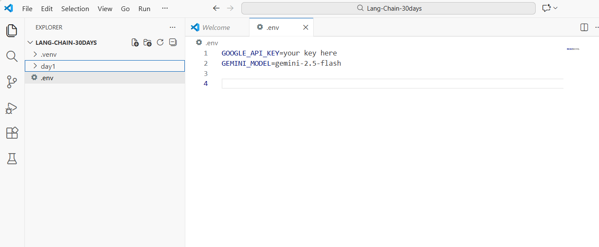
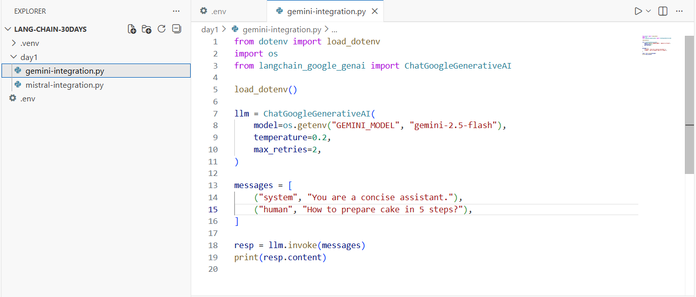
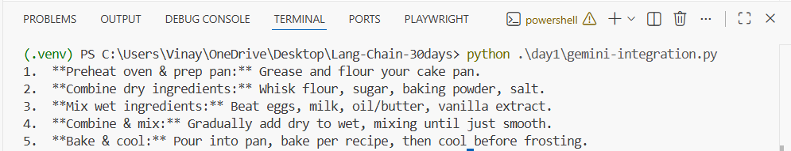

# Day 1 — LangChain + Gemini (Python) ✅

This guide documents your **Day 1 setup** where you successfully ran a LangChain script using **Google Gemini** and got output in the terminal.

---

## What you built

- A Python project with a virtual environment (`.venv`)
- A `.env` file holding your Gemini API key + model name
- A Day 1 script: `day1/gemini-integration.py`
- You executed it and got a valid response

---

## Prerequisites

### Required
- **Python 3.10+** (3.11/3.12 also works)
- **VS Code** (or any editor)
- **Internet connection**
- A **Gemini API key** (Google AI Studio)

### Python packages
Install these inside your virtual environment:

```bash
pip install -U python-dotenv langchain-google-genai
```

> `python-dotenv` loads your `.env` file  
> `langchain-google-genai` is the LangChain integration package for Gemini

---

## Project structure (your setup)

```
LANG-CHAIN-30DAYS/
├─ .venv/
├─ .env
└─ day1/
   ├─ gemini-integration.py
   └─ mistral-integration.py   (next task)
```

---

## Step 1 — Create `.env` (API Key + Model)

Create a file named **`.env`** in the root of your project:

```env
GOOGLE_API_KEY=your_key_here
GEMINI_MODEL=gemini-2.5-flash
```

Screenshot (your `.env`):



**Important notes**
- The filename must be exactly **`.env`**
- Keep your API key private (don’t commit to GitHub)

---

## Step 2 — Gemini integration code

Create `day1/gemini-integration.py`:

```python
from dotenv import load_dotenv
import os
from langchain_google_genai import ChatGoogleGenerativeAI

load_dotenv()

llm = ChatGoogleGenerativeAI(
    model=os.getenv("GEMINI_MODEL", "gemini-2.5-flash"),
    temperature=0.2,
    max_retries=2,
)

messages = [
    ("system", "You are a concise assistant."),
    ("human", "How to prepare cake in 5 steps?"),
]

resp = llm.invoke(messages)
print(resp.content)
```

Screenshot (your file):



---

## Code brief explanation (easy)

- `load_dotenv()`  
  Loads environment variables from your `.env` file into `os.environ`.

- `ChatGoogleGenerativeAI(...)`  
  Creates a Gemini chat model client (LangChain wrapper).

- `model=os.getenv("GEMINI_MODEL", "...")`  
  Reads the model name from `.env`. If missing, uses the default.

- `messages = [...]`  
  Chat messages.  
  - `"system"` sets assistant behavior  
  - `"human"` is the user question

- `llm.invoke(messages)`  
  Sends the messages to Gemini and returns the model response.

- `print(resp.content)`  
  Prints the final answer text returned by Gemini.

---

## Step 3 — Run the script

From the project root:

```bash
python .\day1\gemini-integration.py
```

(Windows PowerShell uses the double backslashes above)

Screenshot (your successful output):



---

## Troubleshooting

### 1) API key not loading
- Ensure `.env` is in the project root (same level as `day1/`)
- Ensure you installed `python-dotenv`
- Restart the terminal after creating `.env`

### 2) Auth / Permission error
- Double-check the API key value
- Confirm the key is active in Google AI Studio

### 3) Module not found
Run install again (inside venv):

```bash
pip install -U python-dotenv langchain-google-genai
```

---

## Next task (Task 2) — Mistral
You already created `mistral-integration.py`. Next we’ll:
- add `MISTRAL_API_KEY` to `.env`
- install `langchain-mistralai`
- run Mistral with the same message format
