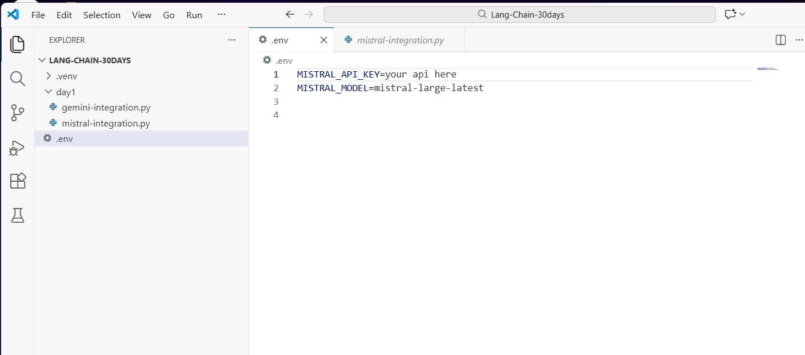
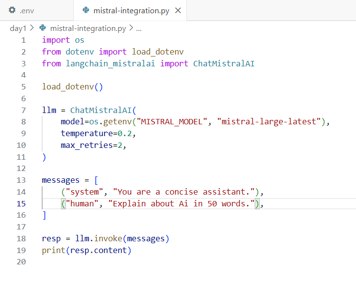
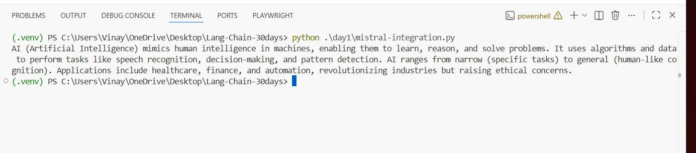

# Day 1 — LangChain + Mistral (Python) ✅

This guide documents your **Task 2** where you successfully ran a LangChain script using **Mistral** and received the response in the terminal.

---

## What you built

- A Python project with a virtual environment (`.venv`)
- A `.env` file holding your **Mistral API key** + **model name**
- A Day 1 script: `day1/mistral-integration.py`
- You executed it successfully and got a valid answer

---

## Prerequisites

### Required
- **Python 3.10+**
- **VS Code** (or any IDE)
- **Internet connection**
- A **Mistral API key** (from Mistral platform)

### Python packages
Install these inside your virtual environment:

```bash
pip install -U python-dotenv langchain-mistralai
```

> `python-dotenv` loads environment variables from `.env`  
> `langchain-mistralai` is the LangChain integration package for Mistral

---

## Your project structure

```
LANG-CHAIN-30DAYS/
├─ .venv/
├─ .env
└─ day1/
   ├─ gemini-integration.py
   └─ mistral-integration.py
```

---

## Step 1 — Create/Update `.env` for Mistral

Open your `.env` file and add:

```env
MISTRAL_API_KEY=your_api_here
MISTRAL_MODEL=mistral-large-latest
```

Screenshot (your `.env` Mistral config):



**Important notes**
- Keep API keys private (don’t commit them)
- The file must be named **`.env`** exactly

---

## Step 2 — Mistral integration code

Create `day1/mistral-integration.py`:

```python
import os
from dotenv import load_dotenv
from langchain_mistralai import ChatMistralAI

load_dotenv()

llm = ChatMistralAI(
    model=os.getenv("MISTRAL_MODEL", "mistral-large-latest"),
    temperature=0.2,
    max_retries=2,
)

messages = [
    ("system", "You are a concise assistant."),
    ("human", "Explain about AI in 50 words."),
]

resp = llm.invoke(messages)
print(resp.content)
```

Screenshot (your Mistral code file):



---

## Code brief explanation (easy)

- `load_dotenv()`  
  Loads environment variables from `.env` into your program.

- `ChatMistralAI(...)`  
  Creates the Mistral chat model client (LangChain wrapper).

- `model=os.getenv("MISTRAL_MODEL", "...")`  
  Reads the model name from `.env`. If not set, it uses the default.

- `messages = [...]`  
  Chat messages:
  - `"system"`: rules/behavior for the assistant
  - `"human"`: your question/prompt

- `llm.invoke(messages)`  
  Makes one request to the Mistral model and returns a response.

- `print(resp.content)`  
  Prints the final text output.

---

## Step 3 — Run the script

From your project root:

```bash
python .\day1\mistral-integration.py
```

Screenshot (your successful terminal output):



---

## Troubleshooting

### 1) API key error
- Confirm `MISTRAL_API_KEY` is correct
- Ensure `.env` is in the project root

### 2) Module not found
Install again inside venv:

```bash
pip install -U langchain-mistralai python-dotenv
```

### 3) Wrong model name
If `mistral-large-latest` fails, try:
- `mistral-small-latest`
- `mistral-medium-latest`

(Your Mistral account access can vary.)

---

## Next step (Day 2 preview)
Tomorrow we’ll create a **single switcher script**:
- same prompt
- run on Gemini OR Mistral based on config
- compare outputs cleanly
