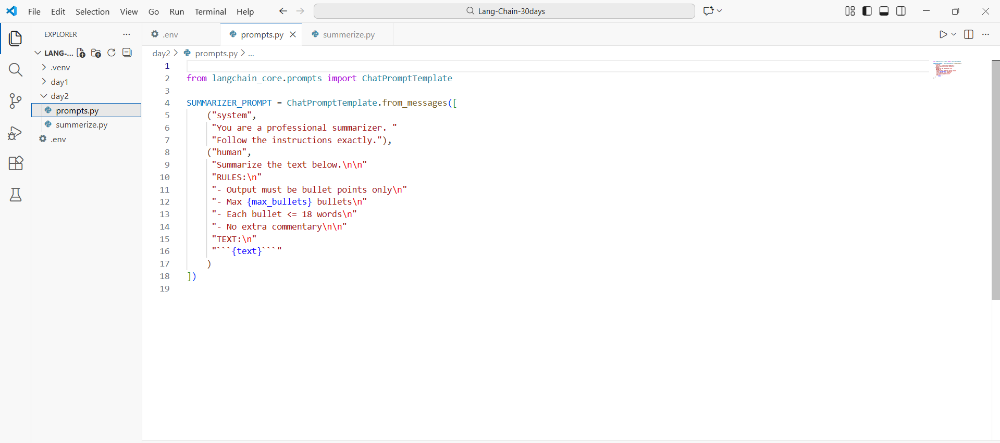
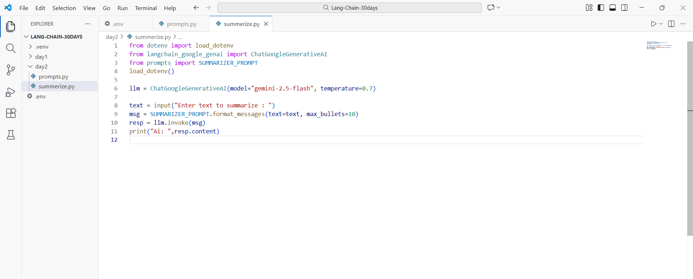
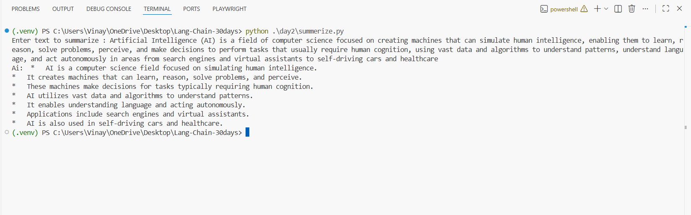

# Day 2 — Prompt Templates That Don’t Break (Summarizer) ✅

This guide documents your **Day 2 - Task 1** where you created a reusable **prompt library** (`prompts.py`) and used it from `summarize.py` to generate bullet-point summaries using **LangChain + Gemini**.

---

## What you built (today)

- `day2/prompts.py` → a reusable **ChatPromptTemplate** for summarization
- `day2/summarize.py` → a runner script that:
  - takes input text from the terminal
  - formats the prompt with variables
  - calls Gemini with LangChain
  - prints the summary output

---

## Prerequisites

### Required
- **Python 3.10+**
- **VS Code** (or any editor)
- **Internet connection**
- **Gemini API key**
- A `.env` file in your project root (from Day 1)

### Python packages
Install inside your virtual environment:

```bash
pip install -U python-dotenv langchain langchain-core langchain-google-genai
```

---

## Your folder structure

```
LANG-CHAIN-30DAYS/
├─ .venv/
├─ .env
└─ day2/
   ├─ prompts.py
   └─ summarize.py
```

---

## Step 1 — Create `prompts.py` (Prompt Library)

File: `day2/prompts.py`

- Uses `ChatPromptTemplate`
- Adds strict rules so the output is consistent (bullet points only, max bullets, etc.)
- Uses variables: `{text}` and `{max_bullets}`

Screenshot (your `prompts.py`):



### Brief code explanation
- `ChatPromptTemplate.from_messages([...])`  
  Defines a reusable prompt with chat roles:
  - `"system"`: sets behavior (professional summarizer)
  - `"human"`: contains instructions + variables
- `{text}` and `{max_bullets}`  
  Placeholders you fill at runtime using `format_messages(...)`

---

## Step 2 — Create `summarize.py` (Runner Script)

File: `day2/summarize.py`

This script:
1) loads `.env`
2) creates Gemini LLM client
3) takes user input from terminal
4) formats prompt variables
5) calls the model and prints output

Screenshot (your `summarize.py`):



### Brief code explanation
- `load_dotenv()` → loads `GOOGLE_API_KEY` from `.env`
- `ChatGoogleGenerativeAI(...)` → Gemini model wrapper
- `text = input(...)` → lets you paste any text
- `SUMMARIZER_PROMPT.format_messages(text=text, max_bullets=10)`  
  fills prompt placeholders and returns the message list
- `llm.invoke(msg)` → calls Gemini once
- `resp.content` → the final answer text

---

## Step 3 — Run and test

Run from project root:

```bash
python .\day2\summarize.py
```

Paste any paragraph and press Enter.

Screenshot (your output):



---

## Why this prompt “doesn’t break”
- Clear rules (bullet points only, limited bullets, word limit)
- A dedicated system message for consistent behavior
- Variables make it reusable for different inputs and bullet counts

---

## Next upgrade (Day 2 Task 2 + Task 3)
Next we will upgrade `prompts.py` by adding:
- **Rewriter prompt** (tone, audience, format)
- **Classifier prompt** with strict JSON output (labels)

So your prompt library becomes a full reusable module.
