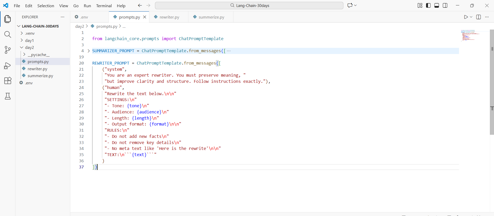
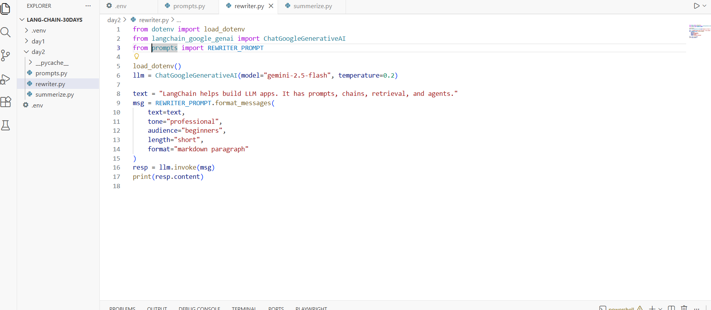
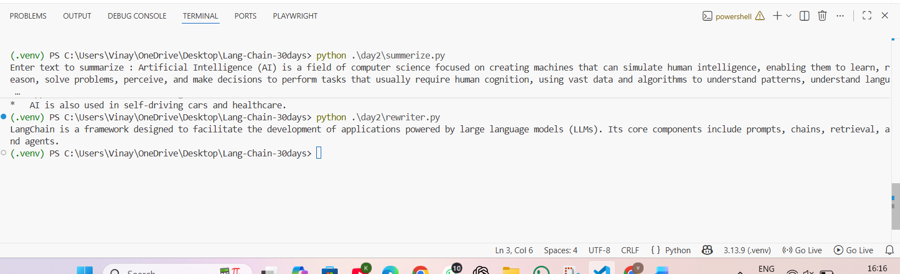

# Day 2 — Task 2 (Rewriter Prompt) ✅

This guide documents **Day 2 - Task 2** where you upgraded your prompt library by adding a **REWRITER_PROMPT** in `prompts.py`, then used it from `rewriter.py` to rewrite text using **LangChain + Gemini**.

---

## What you built

- `day2/prompts.py`
  - contains `SUMMARIZER_PROMPT` (Task 1)
  - contains `REWRITER_PROMPT` (Task 2 upgrade ✅)
- `day2/rewriter.py`
  - imports `REWRITER_PROMPT`
  - formats the prompt with parameters (tone, audience, length, format)
  - calls Gemini and prints the rewritten text

---

## Prerequisites

### Required
- **Python 3.10+**
- **VS Code**
- **Internet connection**
- **Gemini API key** stored in `.env` at project root

Example `.env` (root):
```env
GOOGLE_API_KEY=your_key_here
```

### Python packages
Install inside your virtual environment:

```bash
pip install -U python-dotenv langchain langchain-core langchain-google-genai
```

---

## Folder structure (your setup)

```
LANG-CHAIN-30DAYS/
├─ .venv/
├─ .env
└─ day2/
   ├─ prompts.py
   ├─ summarize.py
   └─ rewriter.py
```

---

## Step 1 — Upgrade `prompts.py` (Add REWRITER_PROMPT)

In `day2/prompts.py`, you added a new prompt template:

- **System message**: enforces rewriting behavior
- **Human message**:
  - accepts variables: `{text}`, `{tone}`, `{audience}`, `{length}`, `{format}`
  - includes strict rules: no new facts, preserve meaning, no meta text

Screenshot (your `prompts.py` showing REWRITER_PROMPT):



### Brief explanation
- `ChatPromptTemplate.from_messages([...])` builds a reusable prompt.
- Variables like `{tone}` and `{audience}` make the same prompt reusable for multiple writing styles.
- Rules make output predictable and “don’t break” format.

---

## Step 2 — Create `rewriter.py` (Runner)

File: `day2/rewriter.py`

This script:
1) loads `.env`
2) creates the Gemini model
3) formats the prompt variables
4) calls the LLM
5) prints the rewritten result

Screenshot (your `rewriter.py`):



### Code brief (what each part does)
- `load_dotenv()` → loads `GOOGLE_API_KEY` from `.env`
- `ChatGoogleGenerativeAI(...)` → creates Gemini LLM client
- `from prompts import REWRITER_PROMPT` → imports prompt from your library
- `REWRITER_PROMPT.format_messages(...)` → fills template variables and returns message list
- `llm.invoke(msg)` → sends messages to Gemini
- `print(resp.content)` → prints rewritten output

---

## Step 3 — Run and verify output

Run from project root:

```bash
python .\day2\rewriter.py
```

Screenshot (your terminal output):



---

## Why Task 2 is an upgrade
Compared to Task 1 (Summarizer), this prompt is more powerful because:
- It supports multiple variables (tone, audience, length, format)
- You can reuse the same template for different rewrite styles
- It prevents the model from adding new facts (stable rewriting)

---

## Next upgrade (Task 3)
Next we will add a **CLASSIFIER_PROMPT** that returns **strict JSON**:
- label
- confidence
- reason
