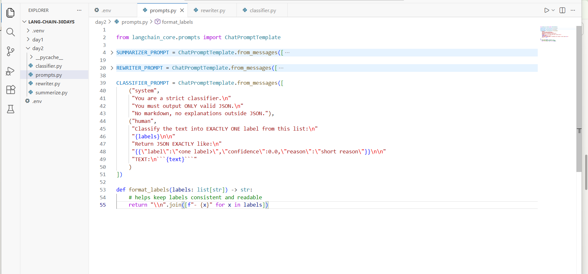
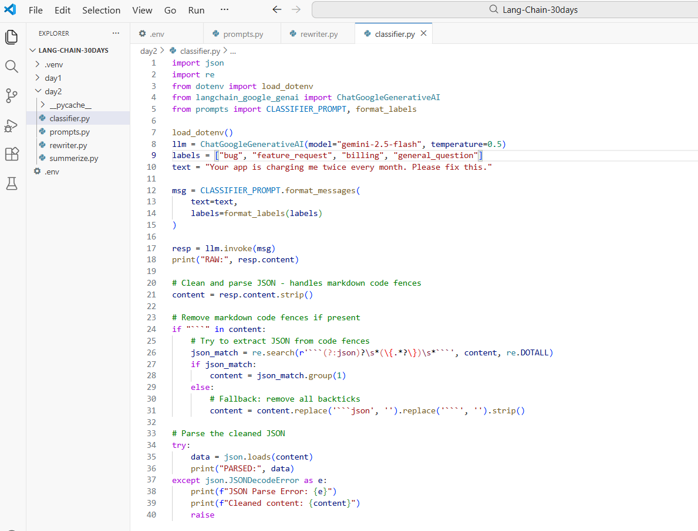
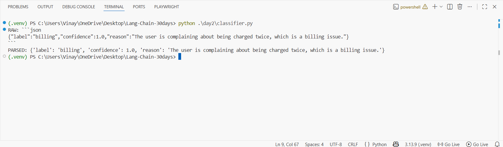

# Day 2 — Task 3 (Classifier Prompt with JSON Output) ✅

This guide documents **Day 2 - Task 3**, where you upgraded your prompt library by adding a **CLASSIFIER_PROMPT** that returns **strict JSON**, then executed `classifier.py` and successfully parsed the JSON response.

This is the **next upgrade after Task 2 (Rewriter)**:
- Task 1: Summarizer prompt
- Task 2: Rewriter prompt (tone/audience/length/format)
- **Task 3: Classifier prompt → automation-ready JSON ✅**

---

## What you built

- `day2/prompts.py`
  - `SUMMARIZER_PROMPT`
  - `REWRITER_PROMPT`
  - **`CLASSIFIER_PROMPT` (NEW)**
  - helper: `format_labels(labels)`

- `day2/classifier.py`
  - calls Gemini using LangChain
  - asks the model to pick exactly one label
  - prints raw model output
  - cleans markdown code fences (if model returns ```json)
  - parses JSON and prints a Python dict

---

## Prerequisites

### Required
- **Python 3.10+**
- **VS Code** (or any IDE)
- **Internet connection**
- **Gemini API key**

### `.env` (project root)
Make sure your `.env` exists at the project root:

```env
GOOGLE_API_KEY=your_key_here
GEMINI_MODEL=gemini-2.5-flash
```

### Install packages (inside your venv)
```bash
pip install -U python-dotenv langchain langchain-core langchain-google-genai
```

---

## Folder structure (your setup)

```
LANG-CHAIN-30DAYS/
├─ .venv/
├─ .env
└─ day2/
   ├─ prompts.py
   ├─ summarize.py
   ├─ rewriter.py
   └─ classifier.py
```

---

## Step 1 — Update `prompts.py` (Add CLASSIFIER_PROMPT)

In `day2/prompts.py`, you added a classifier prompt with strict output rules:

- System message forces **JSON only**
- Human message:
  - provides the label list
  - demands **exact JSON format**
  - includes the input text

You also added `format_labels()` to print labels neatly as a bullet list.

Screenshot (your `prompts.py` classifier section):



### Brief explanation
- `CLASSIFIER_PROMPT = ChatPromptTemplate.from_messages([...])` creates a reusable template.
- The strict JSON instruction is what makes this “don’t break” for automation.
- `format_labels(labels)` keeps the label list consistent and readable.

---

## Step 2 — Create `classifier.py` (Runner + JSON Parsing)

File: `day2/classifier.py`

Here’s the exact code you used:

```python
import json
import re
from dotenv import load_dotenv
from langchain_google_genai import ChatGoogleGenerativeAI
from prompts import CLASSIFIER_PROMPT, format_labels

load_dotenv()
llm = ChatGoogleGenerativeAI(model="gemini-2.5-flash", temperature=0.5)
labels = ["bug", "feature_request", "billing", "general_question"]
text = "Your app is charging me twice every month. Please fix this."

msg = CLASSIFIER_PROMPT.format_messages(
    text=text,
    labels=format_labels(labels)
)

resp = llm.invoke(msg)
print("RAW:", resp.content)

# Clean and parse JSON - handles markdown code fences
content = resp.content.strip()

# Remove markdown code fences if present
if "```" in content:
    # Try to extract JSON from code fences
    json_match = re.search(r'```(?:json)?\s*(\{.*?\})\s*```', content, re.DOTALL)
    if json_match:
        content = json_match.group(1)
    else:
        # Fallback: remove all backticks
        content = content.replace('```json', '').replace('```', '').strip()

# Parse the cleaned JSON
try:
    data = json.loads(content)
    print("PARSED:", data)
except json.JSONDecodeError as e:
    print(f"JSON Parse Error: {e}")
    print(f"Cleaned content: {content}")
    raise
```

Screenshot (your `classifier.py`):



---

## Code brief (what it does)

### A) Build the model + prompt input
- `ChatGoogleGenerativeAI(...)` → creates Gemini client
- `labels = [...]` → allowed categories
- `CLASSIFIER_PROMPT.format_messages(...)` → fills `text` and `labels`

### B) Run the model
- `resp = llm.invoke(msg)` → sends messages to Gemini
- `print("RAW:", resp.content)` → shows raw output

### C) Make JSON parsing reliable
Sometimes models wrap JSON in markdown code fences.  
Your code removes those fences, then parses the remaining JSON.

- `strip()` removes extra whitespace
- Regex extracts `{ ... }` from ```json fences
- Fallback removes backticks if regex can’t find a match
- `json.loads(...)` converts JSON string → Python dict

---

## Step 3 — Run and verify output

Run from the project root:

```bash
python .\day2\classifier.py
```

Screenshot (your successful output — RAW + PARSED):



---

## Why Task 3 is an upgrade (and “doesn’t break”)
- Output is **structured JSON**, not free text
- Easy to plug into:
  - ticket routing
  - support automation
  - CRM tagging
  - workflow branching (example: if label == "billing" → handle billing flow)

---

## Next step (Day 3 preview)
Day 3 we’ll build **pipelines (LCEL)** like:

`Prompt → Model → Parser → Output`

So you can chain summarizer + rewriter + classifier together.
