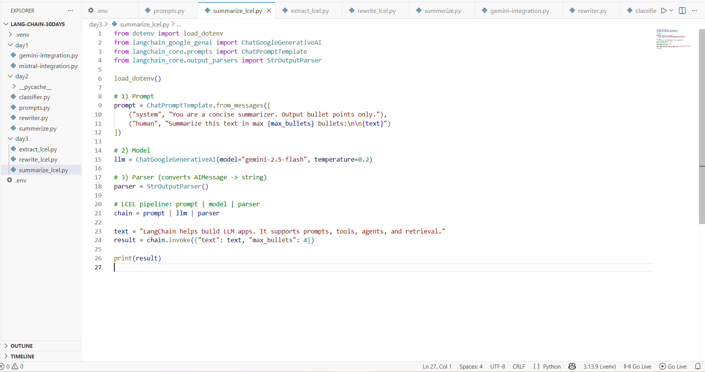
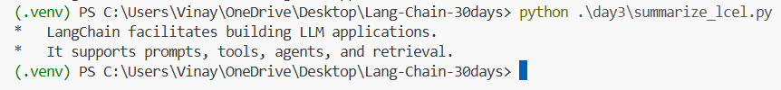

# Day 3 — LCEL Basics (Summarize Pipeline) ✅

This guide documents **Day 3 - Task 1**: building your first LCEL pipeline using the pattern:

**prompt | model | parser**

You created and ran `summarize_lcel.py` successfully and got a bullet summary in the terminal.

---

## What you built

- **LCEL pipeline**
  - `ChatPromptTemplate` (Prompt)
  - `ChatGoogleGenerativeAI` (Model — Gemini)
  - `StrOutputParser` (Parser)
- Output: bullet-point summary (max bullets controlled by a variable)

---

## Prerequisites

### Required
- **Python 3.10+**
- **VS Code** (or any editor)
- **Internet connection**
- **Gemini API Key** (Google AI Studio)

### `.env` file (project root)
Create `.env` in your project root:

```env
GOOGLE_API_KEY=your_key_here
```

### Install packages (inside your virtual environment)
```bash
pip install -U python-dotenv langchain langchain-core langchain-google-genai
```

---

## Your folder structure (recommended)

```
LANG-CHAIN-30DAYS/
├─ .venv/
├─ .env
└─ day3/
   └─ summarize_lcel.py
```

---

## Step 1 — The code (`summarize_lcel.py`)

Screenshot (your script):



### Full code (copy/paste)

```python
from dotenv import load_dotenv
from langchain_google_genai import ChatGoogleGenerativeAI
from langchain_core.prompts import ChatPromptTemplate
from langchain_core.output_parsers import StrOutputParser

load_dotenv()

# 1) Prompt
prompt = ChatPromptTemplate.from_messages([
    ("system", "You are a concise summarizer. Output bullet points only."),
    ("human", "Summarize this text in max {max_bullets} bullets:\n\n{text}")
])

# 2) Model
llm = ChatGoogleGenerativeAI(model="gemini-2.5-flash", temperature=0.2)

# 3) Parser (converts AIMessage -> string)
parser = StrOutputParser()

# LCEL pipeline: prompt | model | parser
chain = prompt | llm | parser

text = "LangChain helps build LLM apps. It supports prompts, tools, agents, and retrieval."
result = chain.invoke({"text": text, "max_bullets": 4})

print(result)
```

---

## Brief explanation (Prompt → Model → Parser)

### 1) Prompt
```python
prompt = ChatPromptTemplate.from_messages([
    ("system", "You are a concise summarizer. Output bullet points only."),
    ("human", "Summarize this text in max {max_bullets} bullets:\n\n{text}")
])
```
- `system` message forces the behavior (bullet points only)
- `human` message contains variables:
  - `{text}` → the content to summarize
  - `{max_bullets}` → controls summary length

### 2) Model
```python
llm = ChatGoogleGenerativeAI(model="gemini-2.5-flash", temperature=0.2)
```
- This creates the Gemini chat model client via LangChain.

### 3) Parser
```python
parser = StrOutputParser()
```
- Converts the model response (`AIMessage`) into a plain Python string.

### LCEL composition (the key part)
```python
chain = prompt | llm | parser
```
- This is LCEL: components are **composed** using `|`.

### Run the chain
```python
result = chain.invoke({"text": text, "max_bullets": 4})
```
- `.invoke()` runs the pipeline once using the variable dict.

---

## Step 2 — Run it

From your project root:

```bash
python .\day3\summarize_lcel.py
```

Screenshot (your terminal output):



---

## Troubleshooting

### 1) `GOOGLE_API_KEY` not found
- Ensure `.env` is in the project root (same level as `day3/`)
- Ensure `load_dotenv()` exists in the script
- Restart terminal after adding `.env`

### 2) `ModuleNotFoundError`
Install again inside `.venv`:
```bash
pip install -U python-dotenv langchain langchain-core langchain-google-genai
```

---

## Next tasks (Day 3 upgrades)
- **Task 2:** Extract pipeline (prompt | model | JSON parser)
- **Task 3:** Rewrite pipeline + batch + streaming
