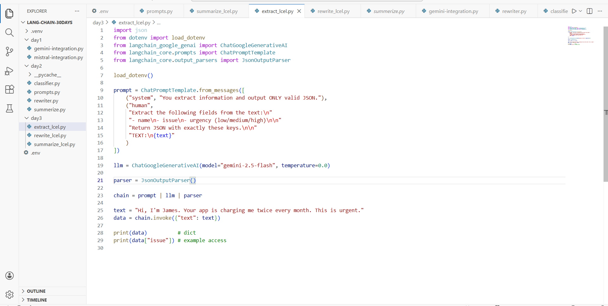
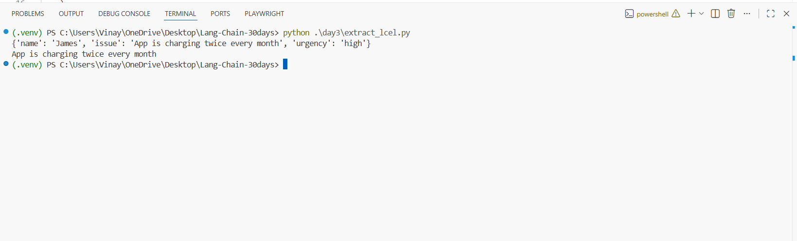

# Day 3 — LCEL Basics (Extract Pipeline) ✅

This guide documents **Day 3 - Task 2**: building an **LCEL extraction pipeline** using:

**prompt | model | parser**

Your pipeline extracts structured fields and returns a **Python dict** (parsed JSON).

---

## What you built

- `ChatPromptTemplate` (Prompt)
- `ChatGoogleGenerativeAI` (Model — Gemini)
- `JsonOutputParser` (Parser → returns dict)
- LCEL chain: `prompt | llm | parser`

Output fields:
- `name`
- `issue`
- `urgency` (`low` / `medium` / `high`)

---

## Prerequisites

### Required
- **Python 3.10+**
- **VS Code**
- **Internet connection**
- **Gemini API Key** (Google AI Studio)

### `.env` (project root)
Create a `.env` file in your project root:

```env
GOOGLE_API_KEY=your_key_here
```

### Install packages (inside your virtual environment)
```bash
pip install -U python-dotenv langchain langchain-core langchain-google-genai
```

---

## Recommended folder structure

```
LANG-CHAIN-30DAYS/
├─ .venv/
├─ .env
└─ day3/
   └─ extract_lcel.py
```

---

## Step 1 — The code (`extract_lcel.py`)

Screenshot (your script):



### Full code (copy/paste)

```python
import json
from dotenv import load_dotenv
from langchain_google_genai import ChatGoogleGenerativeAI
from langchain_core.prompts import ChatPromptTemplate
from langchain_core.output_parsers import JsonOutputParser

load_dotenv()

prompt = ChatPromptTemplate.from_messages([
    ("system", "You extract information and output ONLY valid JSON."),
    ("human",
     "Extract the following fields from the text:\n"
     "- name\n- issue\n- urgency (low/medium/high)\n\n"
     "Return JSON with exactly these keys.\n\n"
     "TEXT:\n{text}"
    )
])

llm = ChatGoogleGenerativeAI(model="gemini-2.5-flash", temperature=0.0)

parser = JsonOutputParser()

chain = prompt | llm | parser

text = "Hi, I'm James. Your app is charging me twice every month. This is urgent."
data = chain.invoke({"text": text})

print(data)          # dict
print(data["issue"]) # example access
```

---

## Brief explanation (Prompt → Model → Parser)

### 1) Prompt (forces JSON + fields)
```python
prompt = ChatPromptTemplate.from_messages([
  ("system", "You extract information and output ONLY valid JSON."),
  ("human", "Extract fields... Return JSON with exactly these keys...")
])
```
- The **system** line makes the model return JSON only.
- The **human** message defines exactly what keys you want.

### 2) Model (Gemini)
```python
llm = ChatGoogleGenerativeAI(model="gemini-2.5-flash", temperature=0.0)
```
- `temperature=0.0` keeps output more consistent for structured extraction.

### 3) Parser (JSON → dict)
```python
parser = JsonOutputParser()
```
- Converts the model output into a **Python dict**.

### LCEL chain (main concept)
```python
chain = prompt | llm | parser
```

### Run the pipeline
```python
data = chain.invoke({"text": text})
```
- `.invoke()` runs the whole pipeline.
- `data` becomes a dict like:
  `{"name": "...", "issue": "...", "urgency": "..."}`

---

## Step 2 — Run and verify output

From your project root:

```bash
python .\day3\extract_lcel.py
```

Screenshot (your successful output):



---

## Troubleshooting

### `GOOGLE_API_KEY` not found
- Ensure `.env` is in the project root (same level as `day3/`)
- Restart terminal after adding `.env`

### Parser errors
If the model prints extra text, strengthen your system message:
- “Output ONLY valid JSON. No markdown. No explanations.”

---

## Next (Day 3 Task 3)
Next you’ll build **rewrite pipeline** with LCEL + show:
- `.invoke()`
- `.batch()` for multiple inputs
- `.stream()` for token/chunk streaming
