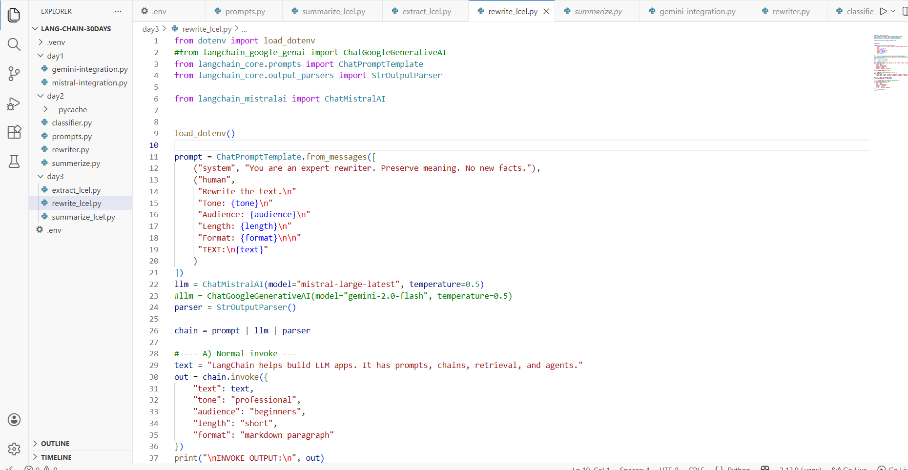
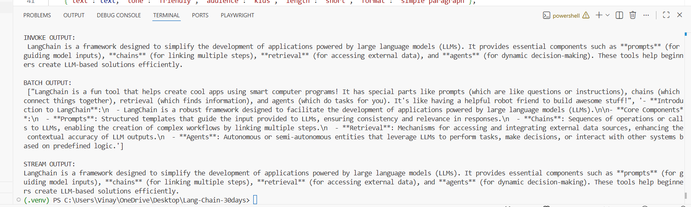

# Day 3 — LCEL Basics (Rewrite Pipeline + Invoke/Batch/Stream) ✅

This guide documents **Day 3 - Task 3**: building an LCEL rewrite pipeline using:

**prompt | model | parser**

You also tested the **3 core execution modes** LCEL makes easy:
- `.invoke()` → run once
- `.batch()` → run many inputs together
- `.stream()` → stream output chunks as they arrive

---

## What you built

### File
- `day3/rewrite_lcel.py`

### LCEL pipeline components
- **Prompt:** `ChatPromptTemplate` (your rewrite instructions + variables)
- **Model:** `ChatMistralAI` (Mistral LLM)
- **Parser:** `StrOutputParser` (turns model message → plain string)

---

## Prerequisites (Noob-friendly)

### 1) Install Python
- Use **Python 3.10+** (recommended 3.11+)

### 2) Create & activate virtual environment (recommended)
From your project folder:

**Windows (PowerShell)**
```bash
python -m venv .venv
.\.venv\Scripts\Activate.ps1
```

### 3) Create your `.env` file (project root)

You are using **Mistral** in this script, so you need a Mistral API key.

Create a file named `.env` in the **project root** (same level as `day3/`):

```env
MISTRAL_API_KEY=your_mistral_api_key_here
```

> If you switch to Gemini (commented line in the code), you also need:
```env
GOOGLE_API_KEY=your_google_api_key_here
```

### 4) Install required packages
Inside the venv, install:

```bash
pip install -U python-dotenv langchain langchain-core langchain-mistralai
```

**Optional (only if you want to use Gemini)**
```bash
pip install -U langchain-google-genai
```

---

## Recommended folder structure

```
LANG-CHAIN-30DAYS/
├─ .venv/
├─ .env
└─ day3/
   └─ rewrite_lcel.py
```

---

## Step 1 — Your code (`rewrite_lcel.py`)

Screenshot (your script):



### Copyable code (exact)

```python
from dotenv import load_dotenv
#from langchain_google_genai import ChatGoogleGenerativeAI
from langchain_core.prompts import ChatPromptTemplate
from langchain_core.output_parsers import StrOutputParser

from langchain_mistralai import ChatMistralAI


load_dotenv()

prompt = ChatPromptTemplate.from_messages([
    ("system", "You are an expert rewriter. Preserve meaning. No new facts."),
    ("human",
     "Rewrite the text.\n"
     "Tone: {tone}\n"
     "Audience: {audience}\n"
     "Length: {length}\n"
     "Format: {format}\n\n"
     "TEXT:\n{text}"
    )
])
llm = ChatMistralAI(model="mistral-large-latest", temperature=0.5)
#llm = ChatGoogleGenerativeAI(model="gemini-2.0-flash", temperature=0.5)
parser = StrOutputParser()

chain = prompt | llm | parser

# --- A) Normal invoke ---
text = "LangChain helps build LLM apps. It has prompts, chains, retrieval, and agents."
out = chain.invoke({
    "text": text,
    "tone": "professional",
    "audience": "beginners",
    "length": "short",
    "format": "markdown paragraph"
})
print("\nINVOKE OUTPUT:\n", out)

# --- B) Batch (multiple rewrites in one go) ---
batch_inputs = [
    {"text": text, "tone": "friendly", "audience": "kids", "length": "short", "format": "simple paragraph"},
    {"text": text, "tone": "formal", "audience": "managers", "length": "medium", "format": "bullet points"},
]
batch_out = chain.batch(batch_inputs)
print("\nBATCH OUTPUT:\n", batch_out)

# --- C) Streaming (prints chunks as they arrive) ---
print("\nSTREAM OUTPUT:\n", end="")
for chunk in chain.stream({
    "text": text,
    "tone": "professional",
    "audience": "beginners",
    "length": "short",
    "format": "markdown paragraph"
}):
    print(chunk, end="")
print()
```

---

## Brief explanation (very simple)

### A) Prompt (what you tell the model)
You create a prompt template with **placeholders** like:
- `{text}` → the input text to rewrite
- `{tone}` → professional / friendly / etc.
- `{audience}` → beginners / kids / managers
- `{length}` → short / medium
- `{format}` → markdown paragraph / bullet points

This makes the prompt reusable.

### B) Model (the LLM)
You use Mistral here:
```python
llm = ChatMistralAI(model="mistral-large-latest", temperature=0.5)
```

> Temperature controls randomness:
- `0.0` = very strict/consistent
- `0.5` = balanced
- `0.9` = more creative

### C) Parser (convert model output to text)
```python
parser = StrOutputParser()
```
Without a parser, you get a message object. With this parser, you get a clean Python string.

### D) LCEL composition (the main LCEL concept)
```python
chain = prompt | llm | parser
```
This `|` means:
1) prompt produces messages  
2) model generates a response  
3) parser converts it to a string  

---

## Step 2 — Run the file

From project root:

```bash
python .\day3\rewrite_lcel.py
```

Screenshot (your output showing invoke + batch + stream):



---

## What each run mode means

### 1) `.invoke()` (single request)
Runs once and gives one rewritten output.

### 2) `.batch()` (many requests)
Runs multiple inputs at once (great for bulk rewriting, datasets, automation).

### 3) `.stream()` (live chunks)
Prints the answer as it is generated (useful for chat UI / live output).

---

## Troubleshooting

### `ModuleNotFoundError: langchain_mistralai`
Install the package:
```bash
pip install -U langchain-mistralai
```

### API key error / Unauthorized
- Confirm `.env` has:
  - `MISTRAL_API_KEY=...`
- Restart the terminal after adding `.env`
- Make sure `load_dotenv()` is called

---

## Next (Day 4 preview)
Next, you’ll combine **Summarize + Extract + Rewrite** into a single workflow:
- reuse your prompt library
- add branching logic
- add retries + error handling
