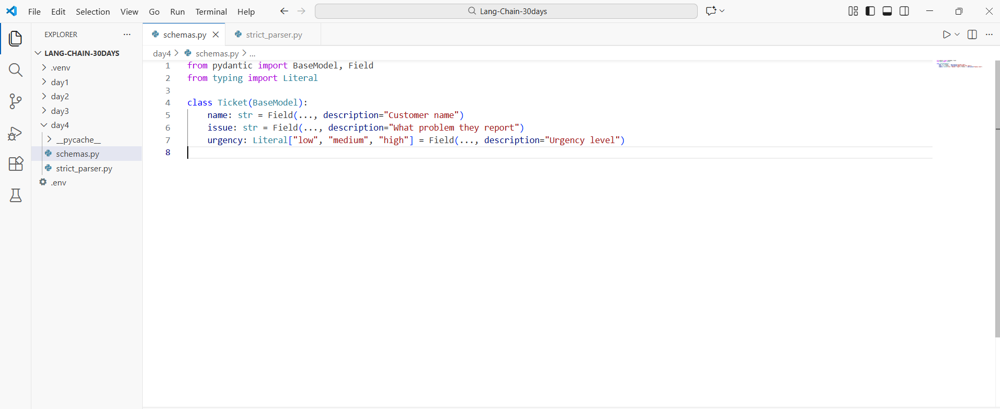
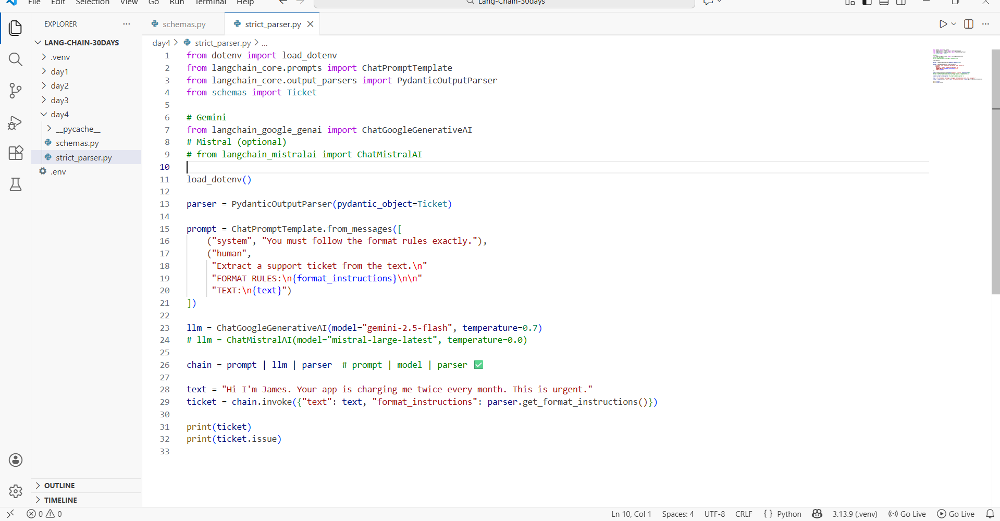
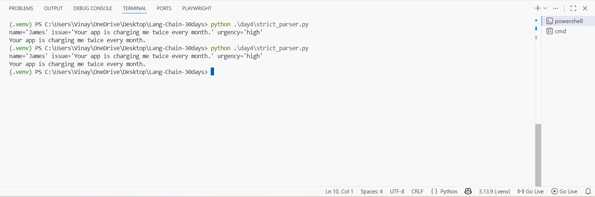

# Day 4 — Parsers + “Clean Outputs” (Task 1: Strict Parser) ✅

This guide shows how you built a **strict structured-output pipeline** in LangChain using:

**prompt | model | parser** (LCEL)

You created:
- `schemas.py` → defines the **data shape** (Ticket)
- `strict_parser.py` → forces the model to return output that matches the schema

---

## What you built (in simple words)

You told the AI:

1. **“Here is the exact format I want (Ticket schema)”**
2. **“Return output ONLY in that format”**
3. LangChain **parses the output** into a real Python object you can use like:
   - `ticket.name`
   - `ticket.issue`
   - `ticket.urgency`

---

## Prerequisites (Noob-friendly)

### 1) Python
- Install **Python 3.10+** (recommended 3.11+)

### 2) Create & activate virtual environment (recommended)

**Windows (PowerShell)**
```bash
python -m venv .venv
.\.venv\Scripts\Activate.ps1
```

### 3) Install required libraries
```bash
pip install -U python-dotenv pydantic langchain langchain-core
```

### 4) Choose your LLM provider

#### Option A — Gemini (what your code uses)
```bash
pip install -U langchain-google-genai
```

Create `.env` in your project root:
```env
GOOGLE_API_KEY=your_google_api_key_here
```

#### Option B — Mistral (optional)
```bash
pip install -U langchain-mistralai
```

Create `.env` in your project root:
```env
MISTRAL_API_KEY=your_mistral_api_key_here
```

---

## Project structure

```
LANG-CHAIN-30DAYS/
├─ .venv/
├─ .env
└─ day4/
   ├─ schemas.py
   └─ strict_parser.py
```

---

## Step 1 — Create the schema (`schemas.py`)

Screenshot:



### Copyable code
```python
from pydantic import BaseModel, Field
from typing import Literal

class Ticket(BaseModel):
    name: str = Field(..., description="Customer name")
    issue: str = Field(..., description="What problem they report")
    urgency: Literal["low", "medium", "high"] = Field(..., description="Urgency level")
```

### What this does
- `Ticket` is a **Pydantic model**
- It defines the ONLY valid output shape:
  - `name` (string)
  - `issue` (string)
  - `urgency` must be one of: `low | medium | high`

---

## Step 2 — Strict parsing (`strict_parser.py`)

Screenshot:



### Copyable code
```python
from dotenv import load_dotenv
from langchain_core.prompts import ChatPromptTemplate
from langchain_core.output_parsers import PydanticOutputParser
from schemas import Ticket

# Gemini
from langchain_google_genai import ChatGoogleGenerativeAI
# Mistral (optional)
# from langchain_mistralai import ChatMistralAI

load_dotenv()

# 1) Parser: tells the model EXACTLY what shape to return
parser = PydanticOutputParser(pydantic_object=Ticket)

# 2) Prompt: injects the parser's format rules into the prompt
prompt = ChatPromptTemplate.from_messages([
    ("system", "You must follow the format rules exactly."),
    ("human",
     "Extract a support ticket from the text.\n"
     "FORMAT RULES:\n{format_instructions}\n\n"
     "TEXT:\n{text}")
])

# 3) Model: choose one (Gemini by default)
llm = ChatGoogleGenerativeAI(model="gemini-2.5-flash", temperature=0.7)
# llm = ChatMistralAI(model="mistral-large-latest", temperature=0.0)

# 4) LCEL pipeline: prompt | model | parser
chain = prompt | llm | parser

# 5) Run
text = "Hi I'm James. Your app is charging me twice every month. This is urgent."
ticket = chain.invoke({
    "text": text,
    "format_instructions": parser.get_format_instructions()
})

print(ticket)        # full object
print(ticket.issue)  # access single field
```

---

## Explanation (short but clear)

### `PydanticOutputParser`
```python
parser = PydanticOutputParser(pydantic_object=Ticket)
```
This tells LangChain:
- “The final output MUST match the Ticket schema”

### Format rules injection
In the prompt you add:
```text
FORMAT RULES:
{format_instructions}
```
LangChain fills `{format_instructions}` using:
```python
parser.get_format_instructions()
```

### LCEL pipeline
```python
chain = prompt | llm | parser
```
Meaning:
1) Prompt builds the message  
2) LLM answers  
3) Parser converts to a `Ticket` object  

### Use the output like a real object
```python
print(ticket.issue)
```

---

## Step 3 — Run the script

From project root:
```bash
python .\day4\strict_parser.py
```

Terminal output screenshot:



---

## Troubleshooting

### `ModuleNotFoundError`
Install missing packages:
```bash
pip install -U python-dotenv pydantic langchain langchain-core
pip install -U langchain-google-genai
```

### API Key not working
- Ensure `.env` is in the **project root**
- Restart your terminal after editing `.env`

### Output format sometimes breaks
That’s normal for LLMs. Next upgrades solve it with:
- output cleaning
- retry on parse errors
- a `safe_invoke()` helper

---

## Next upgrades (Day 4 Task 2 + Task 3)
- **Task 2:** clean output (remove ```json fences + extra text)
- **Task 3:** build `safe_invoke()` → retry until valid format
