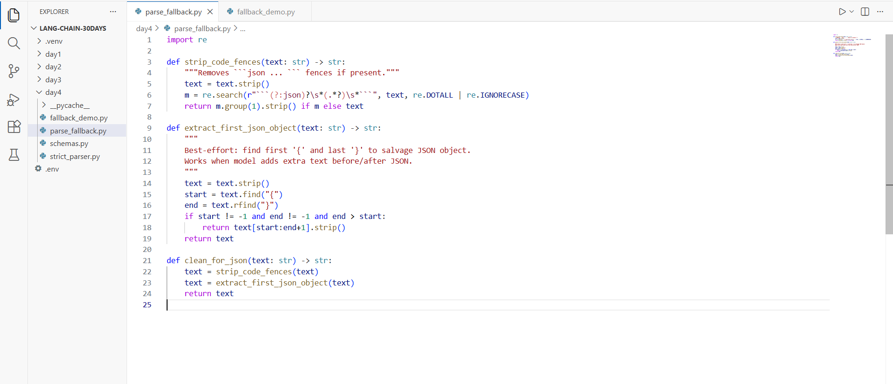
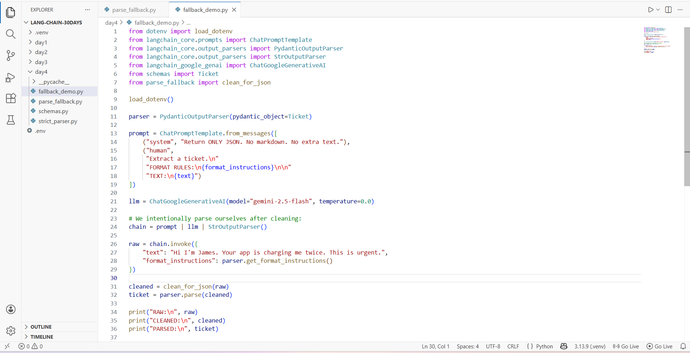
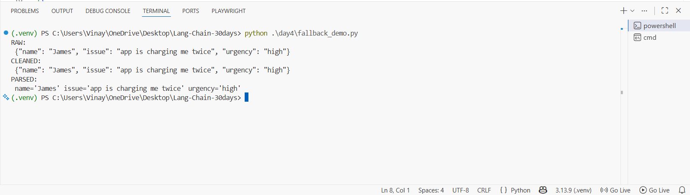

# Day 4 — Parsers + “Clean Outputs” (Task 2: Parsing Fallback) ✅

In Task 1 you used **PydanticOutputParser** to force a strict schema.

But in real life, LLMs sometimes return:
- Markdown code fences like:
  ```json
  {...}
  ```
- Extra text before/after JSON:
  `Sure! Here is the JSON: {...} Thanks!`

So Task 2 adds a **cleanup layer** that makes your parsing much more reliable.

You built:
- `parse_fallback.py` → helper functions to **clean** model output
- `fallback_demo.py` → demo that gets raw output, cleans it, then parses safely

---

## What you will learn (Noob version)

✅ How to **salvage valid JSON** when models output messy formatting  
✅ How to keep a strict schema but still avoid “parser failed” errors  
✅ How to create a clean pipeline:

**prompt | model | string output → clean_for_json() → parser**

---

## Prerequisites

### 1) Python
- Python 3.10+ (recommended 3.11+)

### 2) Virtual environment (recommended)

**Windows (PowerShell)**
```bash
python -m venv .venv
.\.venv\Scripts\Activate.ps1
```

### 3) Install packages
```bash
pip install -U python-dotenv pydantic langchain langchain-core
pip install -U langchain-google-genai
```

### 4) `.env` (project root)
```env
GOOGLE_API_KEY=your_google_api_key_here
```

---

## Folder structure

```
LANG-CHAIN-30DAYS/
├─ .env
└─ day4/
   ├─ schemas.py
   ├─ parse_fallback.py
   └─ fallback_demo.py
```

---

## Step 0 — Schema file (`schemas.py`)

This file is required because the demo parses into a `Ticket` object.

### Copyable code
```python
from pydantic import BaseModel, Field
from typing import Literal

class Ticket(BaseModel):
    name: str = Field(..., description="Customer name")
    issue: str = Field(..., description="What problem they report")
    urgency: Literal["low", "medium", "high"] = Field(..., description="Urgency level")
```

---

## Step 1 — Create the cleanup helpers (`parse_fallback.py`)

Screenshot:



### Copyable code
```python
import re

def strip_code_fences(text: str) -> str:
    """Removes ```json ... ``` fences if present."""
    text = text.strip()
    m = re.search(r"```(?:json)?\s*(.*?)\s*```", text, re.DOTALL | re.IGNORECASE)
    return m.group(1).strip() if m else text


def extract_first_json_object(text: str) -> str:
    """
    Best-effort: find first '{' and last '}' to salvage JSON object.
    Works when the model adds extra text before/after JSON.
    """
    text = text.strip()
    start = text.find("{")
    end = text.rfind("}")
    if start != -1 and end != -1 and end > start:
        return text[start:end + 1].strip()
    return text


def clean_for_json(text: str) -> str:
    """One-stop cleanup before json/pydantic parsing."""
    text = strip_code_fences(text)
    text = extract_first_json_object(text)
    return text
```

### What each helper does

#### `strip_code_fences()`
Removes things like:
```json
{"name": "James"}
```

#### `extract_first_json_object()`
If the model returns:
`Here you go: {"name":"James"} Thanks!`

It extracts ONLY:
`{"name":"James"}`

#### `clean_for_json()`
One function that runs both cleanup steps.

---

## Step 2 — Demo: raw → cleaned → parsed (`fallback_demo.py`)

Screenshot:



### Copyable code
```python
from dotenv import load_dotenv
from langchain_core.prompts import ChatPromptTemplate
from langchain_core.output_parsers import PydanticOutputParser, StrOutputParser
from langchain_google_genai import ChatGoogleGenerativeAI

from schemas import Ticket
from parse_fallback import clean_for_json

load_dotenv()

# 1) Pydantic parser: validates the final JSON against your schema
parser = PydanticOutputParser(pydantic_object=Ticket)

# 2) Prompt: includes strict format instructions from the parser
prompt = ChatPromptTemplate.from_messages([
    ("system", "Return ONLY JSON. No markdown. No extra text."),
    ("human",
     "Extract a ticket.\n"
     "FORMAT RULES:\n{format_instructions}\n\n"
     "TEXT:\n{text}")
])

# 3) Model
llm = ChatGoogleGenerativeAI(model="gemini-2.5-flash", temperature=0.0)

# 4) IMPORTANT: we get raw text first (string output), then we clean + parse ourselves
chain = prompt | llm | StrOutputParser()

raw = chain.invoke({
    "text": "Hi I'm James. Your app is charging me twice. This is urgent.",
    "format_instructions": parser.get_format_instructions()
})

# 5) Cleanup step (handles ```json fences + extra text)
cleaned = clean_for_json(raw)

# 6) Parse into a Ticket object
ticket = parser.parse(cleaned)

print("RAW:\n", raw)
print("CLEANED:\n", cleaned)
print("PARSED:\n", ticket)
```

### Why we use `StrOutputParser()` here
If we do:
`prompt | llm | PydanticOutputParser`

…it can fail immediately when output is messy.

So we do:
1. Get output as plain **string**
2. Clean it
3. Parse it (strict schema) after cleaning

---

## Step 3 — Run the demo

From project root:
```bash
python .\day4\fallback_demo.py
```

Expected terminal output (example):



---

## Troubleshooting

### `ModuleNotFoundError`
Run:
```bash
pip install -U python-dotenv pydantic langchain langchain-core langchain-google-genai
```

### Output still not parseable?
That’s exactly why Day 4 Task 3 exists:
✅ Build `safe_invoke()` that retries automatically when parsing fails.

---

## Next (Task 3)
**safe_invoke() helper**
- try parse
- if parse fails → re-prompt model (“ONLY JSON, fix format”)
- retry up to N times
