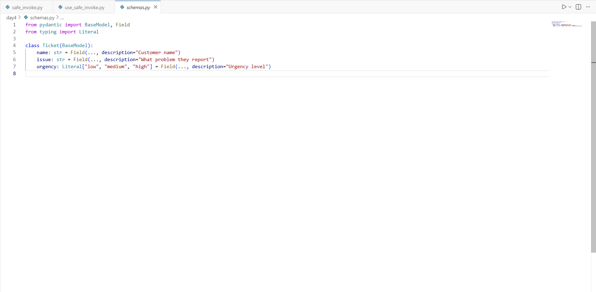
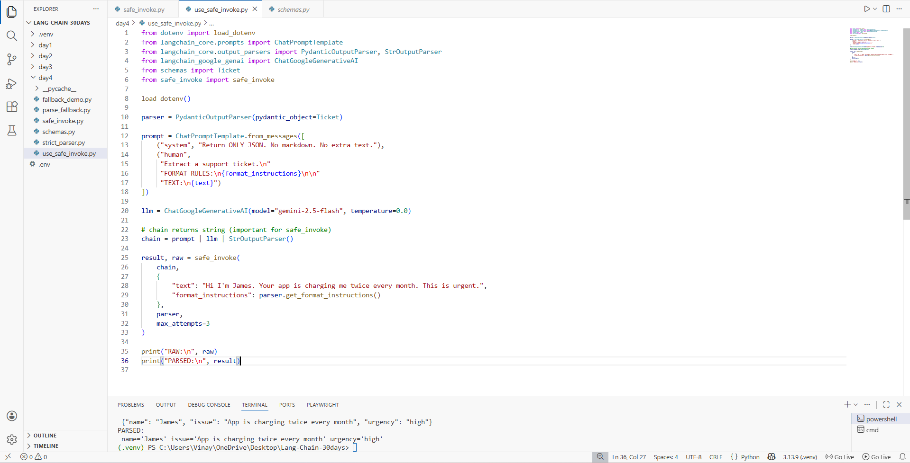
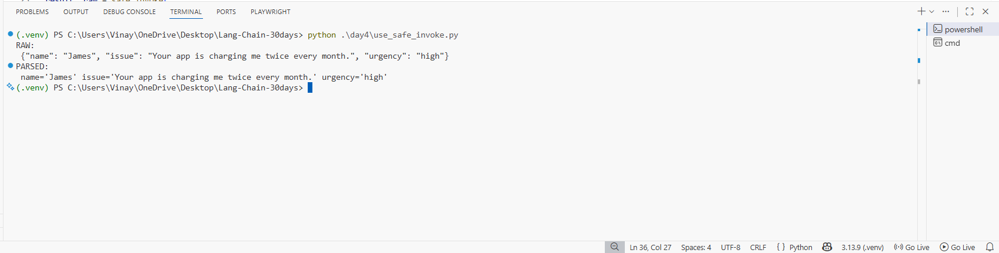

# Day 4 (Task 3) — Parsers + “Clean Outputs” ✅  
## Build a robust `safe_invoke()` helper (retry + parsing fallback)

In Day 4, the goal is: **get clean, structured outputs even when the model behaves imperfectly**.  
This folder shows a practical pattern:

- Define a **strict schema** with Pydantic (`Ticket`)
- Ask the model to return **ONLY JSON**
- If the model still adds extra text / code fences, **clean it**
- If parsing still fails, **retry the model call** (a few attempts) using `safe_invoke()`

---

## What you will build

You will create these files in `day4/`:

1. `schemas.py` → Pydantic schema (`Ticket`)
2. `parse_fallback.py` → helpers to clean/salvage JSON from messy model output
3. `safe_invoke.py` → **safe_invoke()** that:
   - calls the chain
   - tries parse
   - if parse fails → cleans output → tries parse again
   - if still fails → retries the whole call up to `max_attempts`
4. `use_safe_invoke.py` → demo script that uses Gemini + LCEL chain + safe_invoke()

---

## Prerequisites

### 1) Install Python + create venv
- Python **3.10+** (recommended 3.11/3.12)

```bash
python -m venv .venv
# Windows PowerShell
.venv\Scripts\Activate.ps1
# macOS/Linux
source .venv/bin/activate
```

### 2) Install packages

```bash
pip install -U langchain langchain-core langchain-google-genai python-dotenv pydantic
```

### 3) Add your Gemini API key to `.env`

Create a `.env` in the project root:

```env
GOOGLE_API_KEY=your_api_key_here
```

> If your code uses a different env name, keep it consistent (e.g., `GOOGLE_API_KEY` is common for `langchain_google_genai`).

---

## Folder structure (recommended)

```
Lang-Chain-30days/
  .env
  day4/
    schemas.py
    parse_fallback.py
    safe_invoke.py
    use_safe_invoke.py
```

---

## Screenshots (from your setup)

1) Schema (Pydantic model)  


2) The `safe_invoke()` helper  


3) Demo usage (`use_safe_invoke.py`)  


4) Expected output  


---

## Copy‑paste code (noob‑friendly)

### 1) `day4/schemas.py`

```python
from pydantic import BaseModel, Field
from typing import Literal

class Ticket(BaseModel):
    name: str = Field(..., description="Customer name")
    issue: str = Field(..., description="What problem they report")
    urgency: Literal["low", "medium", "high"] = Field(..., description="Urgency level")
```

**What this does**
- `Ticket` is a **strict contract**.
- `urgency` can only be **low / medium / high**.  
  If the model returns something else, parsing will fail (which is good — it forces correctness).

---

### 2) `day4/parse_fallback.py`

This file tries to “rescue” JSON when the model outputs things like:

- ```json
  { ... }
  ```
- Extra text before/after JSON

```python
import re

def strip_code_fences(text: str) -> str:
    """Remove ```json ... ``` wrappers if present."""
    text = text.strip()
    m = re.search(r"```(?:json)?\s*(.*?)\s*```", text, re.DOTALL | re.IGNORECASE)
    return m.group(1).strip() if m else text

def extract_first_json_object(text: str) -> str:
    """
    Best effort: find the first '{' and last '}' to salvage a JSON object.
    Works when the model adds extra text before/after JSON.
    """
    text = text.strip()
    start = text.find("{")
    end = text.rfind("}")
    if start != -1 and end != -1 and end > start:
        return text[start:end + 1].strip()
    return text

def clean_for_json(text: str) -> str:
    """Run all cleanup steps."""
    text = strip_code_fences(text)
    text = extract_first_json_object(text)
    return text
```

**Why this is needed**
Even if you say “ONLY JSON”, models sometimes still add formatting.
This cleanup makes parsing much more reliable.

---

### 3) `day4/safe_invoke.py`

```python
from typing import Any, Dict, Optional, Tuple

from langchain_core.runnables import Runnable
from langchain_core.output_parsers import BaseOutputParser

from parse_fallback import clean_for_json


def safe_invoke(
    chain: Runnable,
    inputs: Dict[str, Any],
    parser: BaseOutputParser,
    *,
    max_attempts: int = 3,
) -> Tuple[Any, str]:
    """
    Run a chain safely and return:
      (parsed_result, raw_text)

    Requirements:
    - `chain` MUST return a string (end your chain with StrOutputParser()).
    - `parser` can be PydanticOutputParser or JsonOutputParser.

    Strategy:
    1) chain.invoke(inputs) -> raw text
    2) Try parser.parse(raw)
    3) If parse fails -> clean_for_json(raw) -> parser.parse(cleaned)
    4) If still fails -> retry the whole model call up to max_attempts
    """
    last_err: Optional[Exception] = None
    last_raw: str = ""

    for attempt in range(1, max_attempts + 1):
        try:
            last_raw = chain.invoke(inputs)

            # 1) Direct parse
            try:
                return parser.parse(last_raw), last_raw

            except Exception:
                # 2) Fallback: clean then parse
                cleaned = clean_for_json(last_raw)
                return parser.parse(cleaned), last_raw

        except Exception as e:
            last_err = e

    # If we reached here, all attempts failed
    raise RuntimeError(
        f"safe_invoke failed after {max_attempts} attempts. Last error: {last_err}\nRaw: {last_raw}"
    )
```

**What this does (simple explanation)**
- First it calls the chain normally.
- Then it tries to parse output (strict).
- If parsing fails, it cleans the text and parses again.
- If anything keeps failing, it tries again (up to `max_attempts`).

---

### 4) `day4/use_safe_invoke.py`

```python
from dotenv import load_dotenv

from langchain_core.prompts import ChatPromptTemplate
from langchain_core.output_parsers import PydanticOutputParser, StrOutputParser
from langchain_google_genai import ChatGoogleGenerativeAI

from schemas import Ticket
from safe_invoke import safe_invoke

load_dotenv()

# 1) Parser that enforces the Ticket schema
parser = PydanticOutputParser(pydantic_object=Ticket)

# 2) Prompt that includes format instructions
prompt = ChatPromptTemplate.from_messages([
    ("system", "Return ONLY JSON. No markdown. No extra text."),
    ("human",
     "Extract a support ticket.\n"
     "FORMAT RULES:\n{format_instructions}\n\n"
     "TEXT:\n{text}")
])

# 3) Model
llm = ChatGoogleGenerativeAI(model="gemini-2.5-flash", temperature=0.0)

# IMPORTANT: chain MUST output a string for safe_invoke()
chain = prompt | llm | StrOutputParser()

result, raw = safe_invoke(
    chain,
    {
        "text": "Hi I'm James. Your app is charging me twice every month. This is urgent.",
        "format_instructions": parser.get_format_instructions(),
    },
    parser,
    max_attempts=3,
)

print("RAW:\n", raw)
print("PARSED:\n", result)
```

---

## Run it

From the project root:

```bash
python .\day4\use_safe_invoke.py
```

Expected output looks like:

- `RAW:` some JSON (maybe with formatting)
- `PARSED:` a validated `Ticket(...)` object

(See screenshot `images/04-output.png`.)

---

## Troubleshooting

### “GOOGLE_API_KEY not found”
- Make sure `.env` is in your **project root** (same folder where you run Python).
- Restart VS Code terminal after editing `.env`.

### Parser keeps failing
- Lower temperature (use `temperature=0.0`)
- Make your prompt stricter: “ONLY JSON, no markdown”
- Increase `max_attempts` to 5

---

## Upgrade ideas (next level)

If you want `safe_invoke()` to be smarter:
- On failure, **re‑ask the model** with an error message like:
  “Your output was invalid JSON. Fix it and return ONLY valid JSON.”
- Add `chain = chain.with_retry(...)` (LangChain supports retries)
- Add logging per attempt

---

If you want, I can also package this as a single `day4.zip` including `schemas.py`, `parse_fallback.py`, `safe_invoke.py`, `use_safe_invoke.py` (ready to run).
