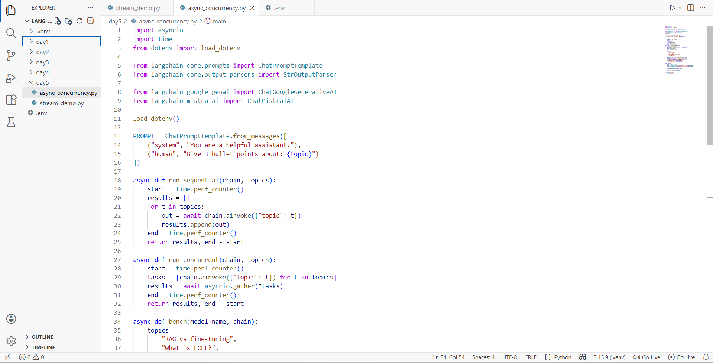
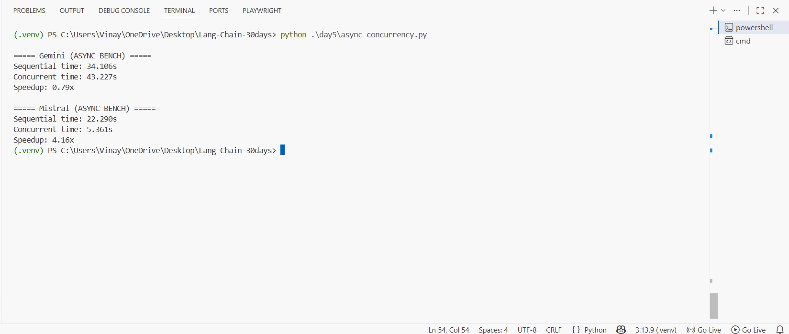

# Day 5 — Async Concurrency Benchmark (Gemini vs Mistral)

This mini-project demonstrates **async invocation + concurrency** in LangChain using:

- `ChatGoogleGenerativeAI` (Gemini)
- `ChatMistralAI` (Mistral)

You will run the same prompt many times and compare:

- **Sequential**: requests run one-by-one
- **Concurrent**: requests run together using `asyncio.gather(...)`

The script prints:

- `Sequential time`: how long it took to process all topics one-by-one
- `Concurrent time`: how long it took to process all topics in parallel
- `Speedup`: `sequential_time / concurrent_time`

## What you’ll build

- A single Python script: `async_concurrency.py`
- It benchmarks two model integrations (Gemini + Mistral)
- It shows you the **correct LangChain async pattern** using `await chain.ainvoke(...)`

## Project files

```
langchain-day5-async-concurrency/
  README.md
  async_concurrency.py
  images/
    01-async-concurrency-code.png
    02-terminal-output.png
```

## Prerequisites

1. **Python 3.10+** (your screenshot shows Python 3.13, that’s fine)
2. A working virtual environment (recommended)
3. API keys:
   - Google Gemini API key
   - Mistral API key

### Install dependencies

From your project root:

```bash
pip install -U python-dotenv langchain-core langchain-google-genai langchain-mistralai
```

> Note: LangChain packages move fast. If you get version issues, upgrade pip first:
>
> ```bash
> python -m pip install -U pip
> ```

## Set up your `.env`

Create a file named `.env` in the same folder where you run the script (often your project root):

```env
# Gemini (LangChain Google GenAI)
GOOGLE_API_KEY="YOUR_GOOGLE_API_KEY"

# Mistral (LangChain MistralAI)
# Different versions sometimes use different names.
# Setting both avoids headaches.
MISTRAL_API_KEY="YOUR_MISTRAL_API_KEY"
MISTRALAI_API_KEY="YOUR_MISTRAL_API_KEY"
```

LangChain Google GenAI models accept an API key via `google_api_key=...` or via environment variables. The LangChain docs show using `GOOGLE_API_KEY` for Google GenAI setup. citeturn14view0turn17search11

## Run the benchmark

```bash
python async_concurrency.py
```

You should see output like:

```
===== Gemini (ASYNC BENCH) =====
Sequential time: ...
Concurrent time: ...
Speedup: ...

===== Mistral (ASYNC BENCH) =====
Sequential time: ...
Concurrent time: ...
Speedup: ...
```

## Screenshots

### 1) Script code



### 2) Terminal output



## Copy‑paste code (async_concurrency.py)

> If you already have the file, you can ignore this section.

```python
import asyncio
import time
from dotenv import load_dotenv

from langchain_core.prompts import ChatPromptTemplate
from langchain_core.output_parsers import StrOutputParser

from langchain_google_genai import ChatGoogleGenerativeAI
from langchain_mistralai import ChatMistralAI

load_dotenv()

PROMPT = ChatPromptTemplate.from_messages([
    ("system", "You are a helpful assistant."),
    ("human", "Give 3 bullet points about: {topic}")
])

async def run_sequential(chain, topics):
    start = time.perf_counter()
    results = []
    for t in topics:
        out = await chain.ainvoke({"topic": t})
        results.append(out)
    end = time.perf_counter()
    return results, end - start

async def run_concurrent(chain, topics):
    start = time.perf_counter()
    tasks = [chain.ainvoke({"topic": t}) for t in topics]
    results = await asyncio.gather(*tasks)
    end = time.perf_counter()
    return results, end - start

async def bench(model_name, chain):
    topics = [
        "RAG vs fine-tuning",
        "What is LCEL?",
        "Token streaming use-cases",
        "Async in Python for LLM apps",
        "Batching requests"
    ]

    seq_out, seq_time = await run_sequential(chain, topics)
    con_out, con_time = await run_concurrent(chain, topics)

    print(f"\n===== {model_name} (ASYNC BENCH) =====")
    print(f"Sequential time: {seq_time:.3f}s")
    print(f"Concurrent time: {con_time:.3f}s")
    print(f"Speedup: {seq_time / con_time:.2f}x" if con_time > 0 else "Speedup: N/A")

async def main():
    parser = StrOutputParser()

    gemini = ChatGoogleGenerativeAI(model="gemini-2.0-flash", temperature=0.0)
    mistral = ChatMistralAI(model="mistral-large-latest", temperature=0.0)

    gemini_chain = PROMPT | gemini | parser
    mistral_chain = PROMPT | mistral | parser

    await bench("Gemini", gemini_chain)
    await bench("Mistral", mistral_chain)

if __name__ == "__main__":
    asyncio.run(main())
```

## How the code works (super simple explanation)

### 1) Prompt + Parser

- `ChatPromptTemplate.from_messages(...)` creates a template prompt.
- The `PROMPT` asks the model: **“Give 3 bullet points about {topic}”**.
- `StrOutputParser()` converts the model output into a plain Python string.

In LangChain, this line builds the pipeline:

- `chain = PROMPT | model | parser`

So the flow becomes:

`input topic` → `prompt` → `model` → `string output`

### 2) Sequential run

`run_sequential(chain, topics)` does:

- loop each topic
- call the model with `await chain.ainvoke({...})`
- measure total time

This is slow because it waits for each request before starting the next.

### 3) Concurrent run

`run_concurrent(chain, topics)` does:

- create a list of async tasks (one per topic)
- runs them together with:

```python
results = await asyncio.gather(*tasks)
```

This can be faster because network calls happen in parallel.

### 4) Benchmark function

`bench(model_name, chain)`:

- defines a small list of topics
- runs sequential and concurrent
- prints:
  - sequential time
  - concurrent time
  - speedup

### 5) Main

- creates **two chains** (Gemini and Mistral)
- runs `bench(...)` for each

## Important note: concurrency is not always faster

Sometimes **concurrent can be slower** because:

- API rate limits (too many requests at once)
- provider-side throttling
- network spikes
- your machine or connection

Your screenshot shows this perfectly: Gemini got slower concurrently, while Mistral got faster.

## Customize the test

Edit the `topics = [...]` list inside `bench()`:

- more topics = bigger test
- fewer topics = quicker test

## Troubleshooting

### 1) `API key not found` / auth errors

- Check `.env` is in the folder where you run Python.
- Make sure you called `load_dotenv()` (your script does).
- Try printing env vars temporarily:

```python
import os
print(os.getenv("GOOGLE_API_KEY"))
print(os.getenv("MISTRAL_API_KEY"))
```

### 2) `Rate limit` / `429` errors

- Reduce the number of topics
- Add a small delay between calls (for sequential)
- For concurrency, limit parallelism (example: `asyncio.Semaphore`)

### 3) Windows + asyncio weirdness

If you see event-loop issues on Windows, upgrade Python and run from a clean terminal.
(Your current setup looks fine.)

## Next upgrade idea (Day 5 Task 3)

- Add **streaming** + record `TTFT` (time to first token)
- Add **batch** runs (multiple iterations) and compute averages
- Export results to CSV for clean comparison
