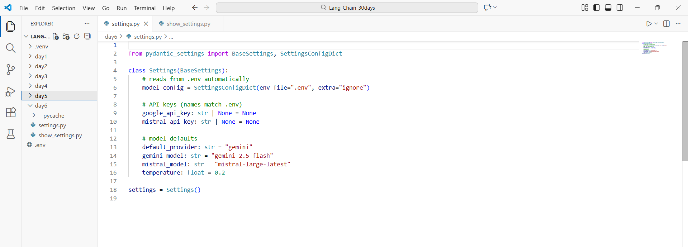
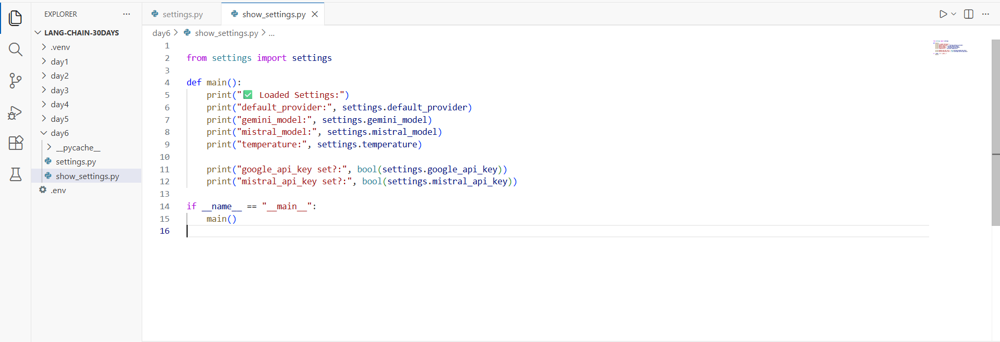
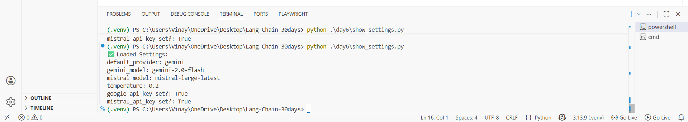

# Day 6 — Configuration + Environment Discipline (Pydantic Settings)

This mini-project shows a clean way to manage **API keys + model defaults + runtime policies** using **Pydantic Settings**.

You will build a single `settings.py` file that reads values from `.env` automatically, and a small script that prints the loaded configuration (without leaking secrets).

---

## What you will get (output)

When you run the demo script, you’ll see something like:

- which provider is default (`gemini` or `mistral`)
- which model names are configured
- temperature / timeout / retries / max tokens
- whether keys are set (**True/False**, not the real key)

---

## Project structure

```
day6/
  settings.py
  show_settings.py           # same as task1_show_settings.py (renamed)
  task1_show_settings.py     # original file name
  requirements.txt
  .env.example
  images/
```

---

## Prerequisites

1. **Python 3.10+**
2. A virtual environment (recommended)
3. API keys (at least one):
   - Gemini: `GOOGLE_API_KEY`
   - Mistral: `MISTRAL_API_KEY`

---

## Setup (step-by-step)

### 1) Create & activate a virtual environment

**Windows (PowerShell)**
```powershell
python -m venv .venv
.\.venv\Scripts\Activate.ps1
```

**macOS / Linux**
```bash
python3 -m venv .venv
source .venv/bin/activate
```

### 2) Install dependencies

```bash
pip install -r day6/requirements.txt
```

### 3) Create your `.env`

Copy the example file and rename it to `.env` **in the project root** (same folder where you run Python from).

**Windows (PowerShell)**
```powershell
copy day6\.env.example .env
```

**macOS / Linux**
```bash
cp day6/.env.example .env
```

Now open `.env` and put your real keys:

```env
GOOGLE_API_KEY=...
MISTRAL_API_KEY=...
```

### 4) Run the demo

```bash
python day6/show_settings.py
```

You should see printed configuration values (and `True/False` for keys).

---

## Screenshots

### 1) `settings.py` (Pydantic Settings)


### 2) `show_settings.py`


### 3) Terminal output


---

## Code (copy‑paste)

### `day6/settings.py`

```python
from pydantic_settings import BaseSettings, SettingsConfigDict


class Settings(BaseSettings):
    # reads from .env automatically
    model_config = SettingsConfigDict(env_file=".env", extra="ignore")

    # API keys (names match .env)
    google_api_key: str | None = None
    mistral_api_key: str | None = None

    # model defaults
    default_provider: str = "gemini"
    gemini_model: str = "gemini-2.5-flash"
    mistral_model: str = "mistral-large-latest"
    temperature: float = 0.2

    # policies (runtime safety)
    app_env: str = "dev"          # dev/stage/prod
    timeout_sec: int = 60         # request timeout (seconds)
    max_retries: int = 3          # retry count for transient failures
    max_tokens: int = 256         # response length budget


settings = Settings()
```

### `day6/show_settings.py`

```python
from settings import settings


def main():
    print("Loaded Settings:")
    print("default_provider:", settings.default_provider)
    print("gemini_model:", settings.gemini_model)
    print("mistral_model:", settings.mistral_model)
    print("temperature:", settings.temperature)

    print("timeout_sec:", settings.timeout_sec)
    print("max_retries:", settings.max_retries)
    print("max_tokens:", settings.max_tokens)
    print("app_env:", settings.app_env)

    # We only print True/False so we don't leak secrets in logs
    print("google_api_key set?:", bool(settings.google_api_key))
    print("mistral_api_key set?:", bool(settings.mistral_api_key))


if __name__ == "__main__":
    main()
```

---

## How it works (simple explanation)

### 1) Why `settings.py`?
Instead of hardcoding API keys and defaults inside every script, you keep them in one place:
- **Keys** are stored in `.env`
- **Defaults** (like model names) live in code
- **Policies** (timeout/retries/max tokens) are enforced consistently

### 2) What does `BaseSettings` do?
`BaseSettings` reads environment variables and converts them into Python types for you:
- `"0.2"` becomes a `float`
- `"60"` becomes an `int`
- missing values fall back to defaults

### 3) Why we don’t print real API keys?
Because logs are often shared. Printing only `True/False` is safer.

---

## Common issues

### “google_api_key set?: False”
- Check `.env` exists in the **project root**
- Make sure you copied `.env.example` to `.env`
- Restart terminal / VS Code after editing `.env`

### `ModuleNotFoundError: pydantic_settings`
```bash
pip install -r day6/requirements.txt
```

### `.env not loading`
If you run scripts from a different folder, `.env` might not be found.
Run from your project root:

```bash
python day6/show_settings.py
```

---

## Next upgrades (Day 6 tasks)

- **Task 2:** Use `settings` to create the LLM client (Gemini/Mistral) dynamically.
- **Task 3:** Add “policy enforcement” helpers (temperature caps by environment, retry wrappers, timeouts per call).
