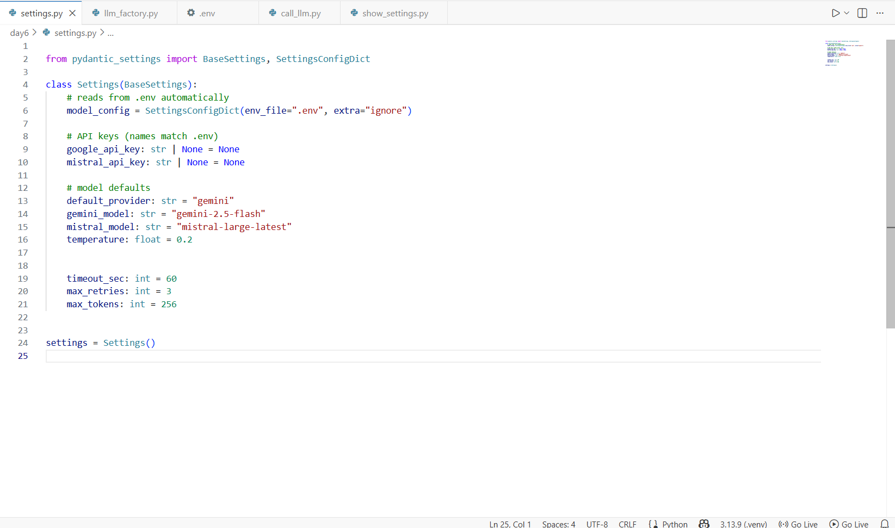
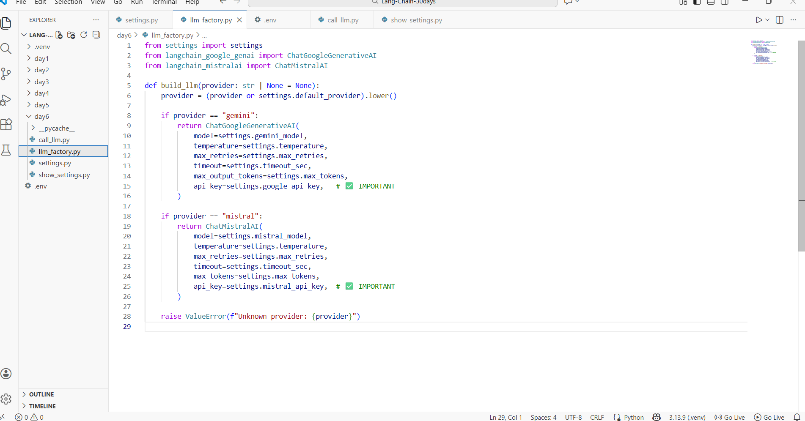
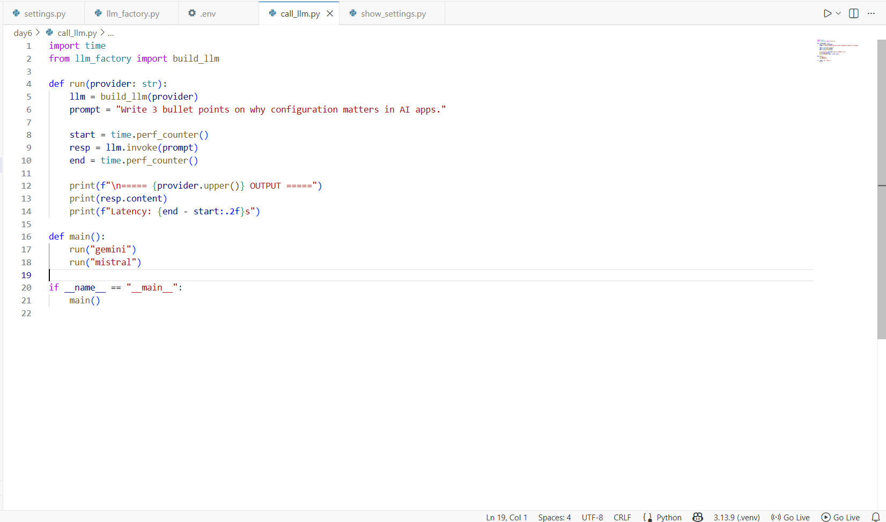
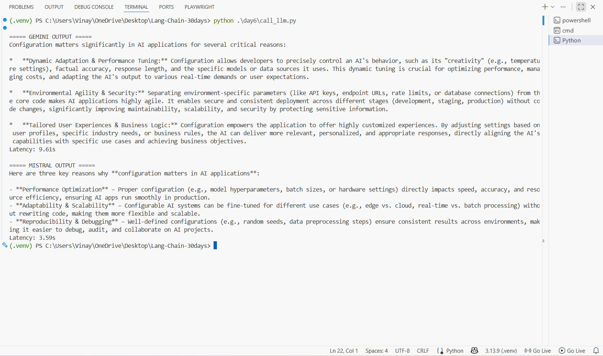

# Day 6 — Configuration + Environment Discipline (Task 2 + Verified Run)

This README documents your **Day 6 setup** using:
- `settings.py` (Pydantic Settings reading `.env`)
- `llm_factory.py` (build Gemini/Mistral clients using the settings)
- `call_llm.py` (runs both models and prints output + latency)
- `show_settings.py` (prints loaded settings so you can debug quickly)

It includes screenshots from your working run.

---

## What you built (in simple words)

### ✅ Why this matters
Instead of hardcoding:
- API keys
- model names
- temperature
- timeouts / retries / max tokens

…you keep them in one place (**settings.py + .env**).  
Then every script uses the same configuration.

---

## Prerequisites

- Python **3.10+**
- A virtual environment (`.venv`) recommended
- API keys:
  - Gemini Developer API key
  - Mistral API key

---

## Install dependencies

From your project root (where `.venv` exists):

```bash
pip install -U pydantic-settings python-dotenv langchain-google-genai langchain-mistralai
```

> If you already installed LangChain earlier, that’s fine.

---

## Your `.env` (project root)

Create a `.env` file in the **project root** (same level as `day1/ day2/ ...`):

```env
GOOGLE_API_KEY=your_google_key_here
MISTRAL_API_KEY=your_mistral_key_here

# defaults
DEFAULT_PROVIDER=gemini
GEMINI_MODEL=gemini-2.5-flash
MISTRAL_MODEL=mistral-large-latest
TEMPERATURE=0.2

TIMEOUT_SEC=60
MAX_RETRIES=3
MAX_TOKENS=256
```

✅ **Important:** In this solution we ALSO pass `api_key=...` directly to the LLM classes, so it works even if the environment variables are not exported by the OS.

---

## Folder structure (Day 6)

```
day6/
  settings.py
  llm_factory.py
  show_settings.py
  call_llm.py
```

---

## Step 1 — `settings.py` (copy-paste)

📌 Purpose: read config from `.env` and expose as `settings`.

```python
from pydantic_settings import BaseSettings, SettingsConfigDict

class Settings(BaseSettings):
    # reads from .env automatically
    model_config = SettingsConfigDict(env_file=".env", extra="ignore")

    # API keys (names match .env)
    google_api_key: str | None = None
    mistral_api_key: str | None = None

    # model defaults
    default_provider: str = "gemini"
    gemini_model: str = "gemini-2.5-flash"
    mistral_model: str = "mistral-large-latest"
    temperature: float = 0.2

    # runtime controls
    timeout_sec: int = 60
    max_retries: int = 3
    max_tokens: int = 256

settings = Settings()
```

---

## Step 2 — `llm_factory.py` (copy-paste)

📌 Purpose: create a model client **using settings** (Gemini or Mistral).

✅ Fix for your earlier error: pass `api_key=settings.google_api_key` so Gemini always receives the key.

```python
from settings import settings
from langchain_google_genai import ChatGoogleGenerativeAI
from langchain_mistralai import ChatMistralAI

def build_llm(provider: str | None = None):
    provider = (provider or settings.default_provider).lower()

    if provider == "gemini":
        return ChatGoogleGenerativeAI(
            model=settings.gemini_model,
            temperature=settings.temperature,
            max_retries=settings.max_retries,
            timeout=settings.timeout_sec,
            max_output_tokens=settings.max_tokens,
            api_key=settings.google_api_key,  # ✅ IMPORTANT
        )

    if provider == "mistral":
        return ChatMistralAI(
            model=settings.mistral_model,
            temperature=settings.temperature,
            max_retries=settings.max_retries,
            timeout=settings.timeout_sec,
            max_tokens=settings.max_tokens,
            api_key=settings.mistral_api_key,  # ✅ IMPORTANT
        )

    raise ValueError(f"Unknown provider: {provider}")
```

---

## Step 3 — `show_settings.py` (copy-paste)

📌 Purpose: quick debug. Confirms keys + config are loaded.

```python
from settings import settings

def main():
    print("✅ Loaded Settings:")
    print("default_provider:", settings.default_provider)
    print("gemini_model:", settings.gemini_model)
    print("mistral_model:", settings.mistral_model)
    print("temperature:", settings.temperature)

    print("google_api_key set?:", bool(settings.google_api_key))
    print("mistral_api_key set?:", bool(settings.mistral_api_key))

if __name__ == "__main__":
    main()
```

Run it:

```bash
python .\day6\show_settings.py
```

---

## Step 4 — `call_llm.py` (copy-paste)

📌 Purpose: run Gemini + Mistral and print output + latency.

```python
import time
from llm_factory import build_llm

def run(provider: str):
    llm = build_llm(provider)
    prompt = "Write 3 bullet points on why configuration matters in AI apps."

    start = time.perf_counter()
    resp = llm.invoke(prompt)
    end = time.perf_counter()

    print(f"\n===== {provider.upper()} OUTPUT =====")
    print(resp.content)
    print(f"Latency: {end - start:.2f}s")

def main():
    run("gemini")
    run("mistral")

if __name__ == "__main__":
    main()
```

Run it:

```bash
python .\day6\call_llm.py
```

---

## Screenshots (your run)

### 1) `settings.py`


### 2) `llm_factory.py`


### 3) `call_llm.py`


### 4) Terminal output (Gemini + Mistral)


---

## Troubleshooting

### ❌ Error: “API key required for Gemini Developer API”
✅ Fix:
- Make sure `.env` has `GOOGLE_API_KEY=...`
- Ensure `llm_factory.py` includes:
  ```python
  api_key=settings.google_api_key
  ```

### ❌ Keys show as False in `show_settings.py`
- Confirm `.env` is in the **project root**
- Restart terminal
- Run again:
  ```bash
  python .\day6\show_settings.py
  ```

---

## Next upgrade (Day 6 Task 3 idea)
Add a **temperature policy** (deterministic/balanced/creative) so you never manually change temperature again.
