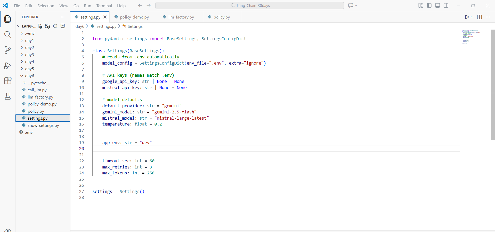
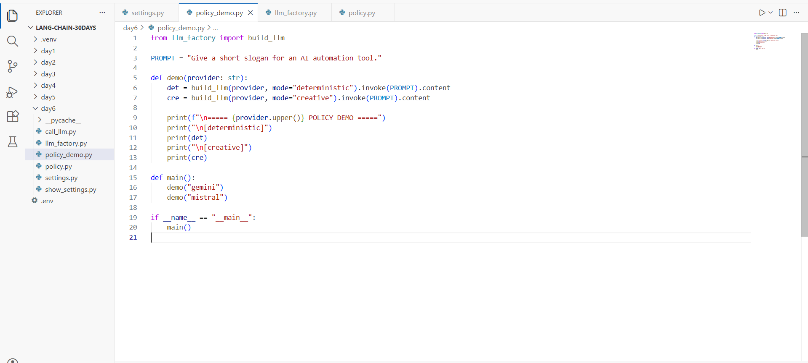
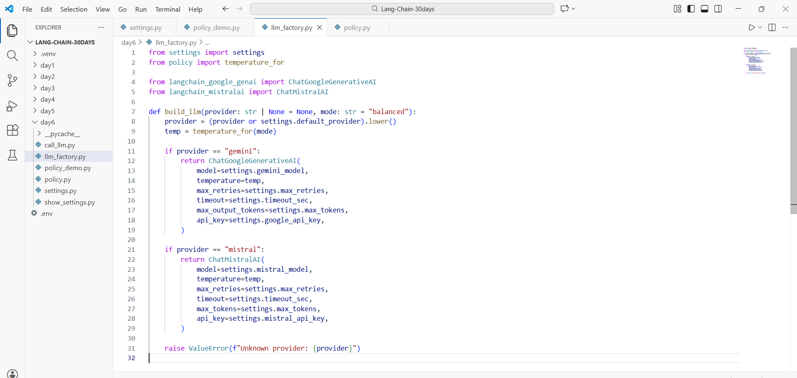
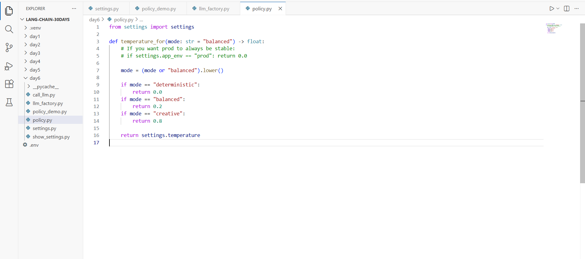
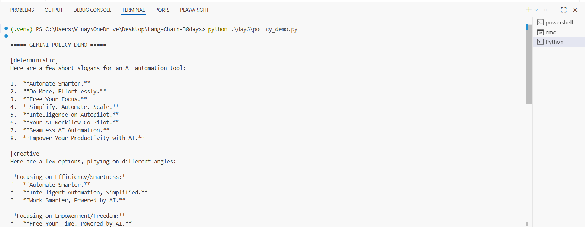

# Day 6 — Task 3: Temperature Policy (Deterministic vs Creative)

This step upgrades Day 6 by adding a **policy layer** that controls model behavior **without editing prompts**.

You’ll run the same prompt twice:
- **deterministic** → stable, repeatable output (temperature ≈ 0)
- **creative** → more variety and brainstorming (temperature ≈ 0.8)

Works with **Gemini + Mistral** using the same `build_llm()` factory.

---

## What you will build

✅ Files:

```
day6/
  settings.py
  policy.py
  llm_factory.py
  policy_demo.py
```

---

## Prerequisites

- Python **3.10+**
- Virtual env recommended: `.venv`
- API keys:
  - Gemini Developer API key
  - Mistral API key

Install packages:

```bash
pip install -U pydantic-settings python-dotenv langchain-google-genai langchain-mistralai
```

---

## 1) Create `.env` (project root)

Create a `.env` at project root:

```env
GOOGLE_API_KEY=your_google_key_here
MISTRAL_API_KEY=your_mistral_key_here

# optional
APP_ENV=dev

# defaults
DEFAULT_PROVIDER=gemini
GEMINI_MODEL=gemini-2.5-flash
MISTRAL_MODEL=mistral-large-latest
TEMPERATURE=0.2

TIMEOUT_SEC=60
MAX_RETRIES=3
MAX_TOKENS=256
```

> Even if you don’t export environment variables in Windows, this project reads `.env` automatically.

---

## 2) settings.py (copy-paste)

```python
from pydantic_settings import BaseSettings, SettingsConfigDict

class Settings(BaseSettings):
    # reads from .env automatically
    model_config = SettingsConfigDict(env_file=".env", extra="ignore")

    # API keys (names match .env)
    google_api_key: str | None = None
    mistral_api_key: str | None = None

    # model defaults
    default_provider: str = "gemini"
    gemini_model: str = "gemini-2.5-flash"
    mistral_model: str = "mistral-large-latest"
    temperature: float = 0.2

    # optional environment flag (useful for policies)
    app_env: str = "dev"

    # runtime controls
    timeout_sec: int = 60
    max_retries: int = 3
    max_tokens: int = 256

settings = Settings()
```

**What it does:**
- Reads `.env`
- Keeps all config in one place (`settings`)
- You never hardcode keys/models in scripts

---

## 3) policy.py (copy-paste)

```python
from settings import settings

def temperature_for(mode: str = "balanced") -> float:
    # If you want prod to always be stable:
    # if settings.app_env == "prod": return 0.0

    mode = (mode or "balanced").lower()

    if mode == "deterministic":
        return 0.0
    if mode == "balanced":
        return 0.2
    if mode == "creative":
        return 0.8

    return settings.temperature
```

**What it does (super simple):**
- If mode is `"deterministic"` → returns `0.0`
- If mode is `"creative"` → returns `0.8`
- Otherwise → uses your default `settings.temperature`

---

## 4) llm_factory.py (copy-paste)

```python
from settings import settings
from policy import temperature_for

from langchain_google_genai import ChatGoogleGenerativeAI
from langchain_mistralai import ChatMistralAI

def build_llm(provider: str | None = None, mode: str = "balanced"):
    provider = (provider or settings.default_provider).lower()
    temp = temperature_for(mode)

    if provider == "gemini":
        return ChatGoogleGenerativeAI(
            model=settings.gemini_model,
            temperature=temp,
            max_retries=settings.max_retries,
            timeout=settings.timeout_sec,
            max_output_tokens=settings.max_tokens,
            api_key=settings.google_api_key,
        )

    if provider == "mistral":
        return ChatMistralAI(
            model=settings.mistral_model,
            temperature=temp,
            max_retries=settings.max_retries,
            timeout=settings.timeout_sec,
            max_tokens=settings.max_tokens,
            api_key=settings.mistral_api_key,
        )

    raise ValueError(f"Unknown provider: {provider}")
```

**Key upgrade vs Task 2:**
- `build_llm()` now accepts `mode=...`
- It uses `temperature_for(mode)` to choose the temperature automatically

So you can do:

```python
build_llm("gemini", mode="deterministic")
build_llm("gemini", mode="creative")
```

---

## 5) policy_demo.py (copy-paste)

```python
from llm_factory import build_llm

PROMPT = "Give a short slogan for an AI automation tool."

def demo(provider: str):
    det = build_llm(provider, mode="deterministic").invoke(PROMPT).content
    cre = build_llm(provider, mode="creative").invoke(PROMPT).content

    print(f"\n===== {provider.upper()} POLICY DEMO =====")
    print("\n[deterministic]")
    print(det)
    print("\n[creative]")
    print(cre)

def main():
    demo("gemini")
    demo("mistral")

if __name__ == "__main__":
    main()
```

---

## Run the demo

From project root:

```bash
python .\day6\policy_demo.py
```

Expected output:
- It prints **Gemini** deterministic + creative
- Then **Mistral** deterministic + creative

---

## Screenshots

### 1) settings.py


### 2) policy_demo.py


### 3) llm_factory.py


### 4) policy.py


### 5) Terminal output


---

## Troubleshooting

### ❌ Error: `build_llm() got an unexpected keyword argument 'mode'`
✅ Fix:
- Update `build_llm()` signature to:
  ```python
  def build_llm(provider: str | None = None, mode: str = "balanced"):
  ```

### ❌ API key missing
✅ Fix:
- Ensure `.env` has:
  - `GOOGLE_API_KEY=...`
  - `MISTRAL_API_KEY=...`
- And ensure factory passes:
  - `api_key=settings.google_api_key`
  - `api_key=settings.mistral_api_key`

---

## Next upgrade idea
Add **policy presets per environment**:
- `dev` → balanced
- `prod` → deterministic
- `experiments` → creative
