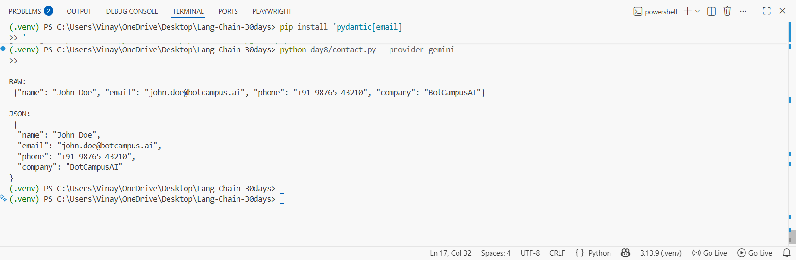
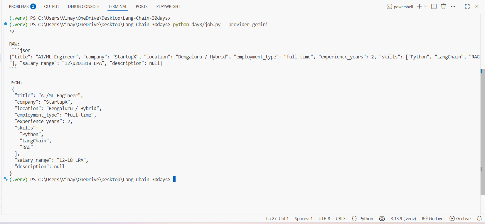
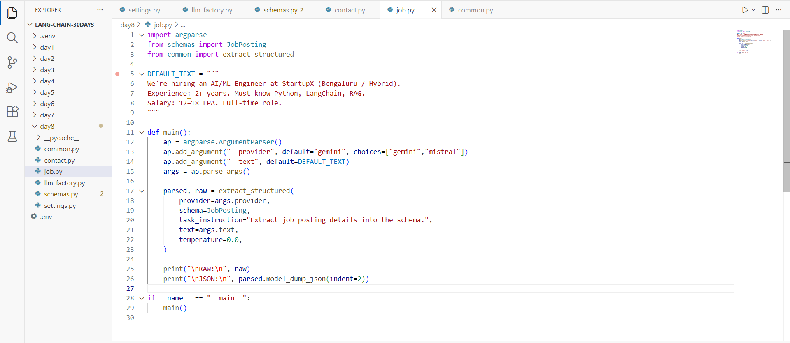

# Day 8 — Structured Output (Pydantic-first) with LangChain

Day 8 is about **structured output**: you tell the LLM to respond in a strict format, then you **validate** it with **Pydantic**.

You will build **5 extractors** (5 schemas):

1) **Contact extraction**
2) **Job posting extraction**
3) **Meeting minutes**
4) **Product review JSON**
5) **Ticket triage**

Each task prints:
- **RAW**: the model’s raw text
- **JSON**: the validated Pydantic object printed as pretty JSON

---

## Screenshots

> Put screenshots inside an `images/` folder and reference them like this:





---

## Prerequisites (must have)

1) **Python 3.10+**
2) A virtual environment (recommended)
3) **API key** for at least one provider:
   - Gemini (Google AI Studio) OR
   - Mistral
4) Basic terminal usage (PowerShell/CMD)

---

## Install dependencies

From your project root:

```bash
python -m venv .venv
# Windows
.\\.venv\\Scripts\\activate
# macOS/Linux
# source .venv/bin/activate

pip install -U langchain langchain-core python-dotenv pydantic pydantic-settings
pip install -U langchain-google-genai langchain-mistralai

# IMPORTANT: EmailStr needs this extra (for Contact schema)
pip install -U "pydantic[email]"
```

---

## Set up `.env` (API keys)

Create a `.env` file in your **project root** (same level as `day8/`):

```env
GOOGLE_API_KEY=YOUR_GEMINI_KEY_HERE
MISTRAL_API_KEY=YOUR_MISTRAL_KEY_HERE
```

Notes:
- If you only use Gemini, you can keep only `GOOGLE_API_KEY`.
- If you only use Mistral, you can keep only `MISTRAL_API_KEY`.

---

## Recommended folder structure

```
Lang-Chain-30days/
  day8/
    contact.py              (or task1_contact.py)
    job.py                  (or task2_job_posting.py)
    minutes.py              (or task3_meeting_minutes.py)
    review.py               (or task4_product_review.py)
    ticket.py               (or task5_ticket_triage.py)

    common.py
    schemas.py
    llm_factory.py
    settings.py
  .env
```

> Your filenames might be `task1_contact.py` etc (from my earlier zip).
> If you renamed them to `contact.py`, `job.py`, etc — the code is the same.

---

## Run (all 5 tasks)

### 1) Contact extraction

```bash
python day8/contact.py --provider gemini
# OR
python day8/task1_contact.py --provider gemini
```

Pass your own text:

```bash
python day8/contact.py --provider gemini --text "Reach John Doe at john.doe@botcampus.ai, +91-98765-43210, BotCampusAI."
```

---

### 2) Job posting extraction

```bash
python day8/job.py --provider gemini
# OR
python day8/task2_job_posting.py --provider gemini
```

With your own job text:

```bash
python day8/job.py --provider mistral --text "Hiring AI/ML Engineer in Bengaluru (Hybrid). 2+ yrs. Python, LangChain, RAG. Salary 12-18 LPA."
```

---

### 3) Meeting minutes extraction

```bash
python day8/task3_meeting_minutes.py --provider gemini
```

Custom input:

```bash
python day8/task3_meeting_minutes.py --provider gemini --text "Meeting: launch planning. Decisions: ship on Friday. Action items: Rahul updates docs by Wed; Vinay tests flows by Thu."
```

---

### 4) Product review → JSON

```bash
python day8/task4_product_review.py --provider mistral
```

Custom input:

```bash
python day8/task4_product_review.py --provider gemini --text "I bought the NoiseFit watch. Battery is amazing, but strap feels cheap. 4/5."
```

---

### 5) Ticket triage → JSON

```bash
python day8/task5_ticket_triage.py --provider gemini
```

Custom input:

```bash
python day8/task5_ticket_triage.py --provider gemini --text "Payment failed for multiple users since 10am. Checkout throws 500. Please fix ASAP."
```

---

## How this works (simple explanation)

### A) Pydantic schemas = your “JSON contract”
In `schemas.py`, each schema (Contact, JobPosting, MeetingMinutes...) defines:
- field names
- field types (string/int/list/etc)
- optional fields
- allowed values (like `priority: low|medium|high|urgent`)

So the output becomes consistent and predictable.

### B) `extract_structured()` does the heavy lifting
In `common.py`:
1. Create a **PydanticOutputParser(schema)**
2. Build a prompt that includes:
   - your instruction
   - your input text
   - the parser’s **format instructions**
3. Call the model
4. Clean markdown fences (```json ... ```)
5. Parse into a real Pydantic object

### C) Provider switching
In `llm_factory.py`, we build an LLM based on `--provider`:
- `gemini` → `ChatGoogleGenerativeAI`
- `mistral` → `ChatMistralAI`

---

## Copy‑paste code (exact files)

> Put these files inside `day8/` (or compare with your existing ones).

### `day8/settings.py`

```python
from pydantic_settings import BaseSettings, SettingsConfigDict


class Settings(BaseSettings):
    model_config = SettingsConfigDict(env_file=".env", extra="ignore")

    google_api_key: str | None = None
    mistral_api_key: str | None = None

    gemini_model: str = "gemini-2.5-flash"
    mistral_model: str = "mistral-large-latest"


settings = Settings()
```

### `day8/llm_factory.py`

```python
from settings import settings

from langchain_google_genai import ChatGoogleGenerativeAI
from langchain_mistralai import ChatMistralAI


def build_llm(provider: str):
    provider = (provider or "gemini").lower()

    if provider == "gemini":
        return ChatGoogleGenerativeAI(
            model=settings.gemini_model,
            api_key=settings.google_api_key,
            temperature=0.0,
        )

    if provider == "mistral":
        return ChatMistralAI(
            model=settings.mistral_model,
            api_key=settings.mistral_api_key,
            temperature=0.0,
        )

    raise ValueError(f"Unknown provider: {provider}")
```

### `day8/schemas.py`

```python
from typing import Literal
from pydantic import BaseModel, Field, EmailStr


class Contact(BaseModel):
    name: str | None = Field(default=None, description="Person name")
    email: EmailStr | None = Field(default=None, description="Email address")
    phone: str | None = Field(default=None, description="Phone number")
    company: str | None = Field(default=None, description="Company name")


class JobPosting(BaseModel):
    title: str | None = None
    company: str | None = None
    location: str | None = None
    employment_type: str | None = None
    experience_years: int | None = None
    skills: list[str] = []
    salary_range: str | None = None
    description: str | None = None


class MeetingMinutes(BaseModel):
    title: str | None = None
    date: str | None = None
    attendees: list[str] = []
    agenda: list[str] = []
    decisions: list[str] = []
    action_items: list[str] = []


class ProductReview(BaseModel):
    product_name: str | None = None
    rating: int | None = Field(default=None, ge=1, le=5)
    pros: list[str] = []
    cons: list[str] = []
    summary: str | None = None


class TicketTriage(BaseModel):
    ticket_id: str | None = None
    category: Literal["bug", "feature", "billing", "support", "other"] = "other"
    priority: Literal["low", "medium", "high", "urgent"] = "medium"
    summary: str | None = None
    next_action: str | None = None
```

### `day8/common.py`

```python
from langchain_core.prompts import ChatPromptTemplate
from langchain_core.output_parsers import PydanticOutputParser, StrOutputParser

from llm_factory import build_llm


def _strip_fences(text: str) -> str:
    """Remove ```json fences if the model adds them."""
    text = text.strip()
    if text.startswith("```"):
        text = text.split("\n", 1)[1]
        if text.endswith("```"):
            text = text[:-3]
    return text.strip()


def extract_structured(provider: str, schema, task_instruction: str, text: str, temperature: float = 0.0):
    llm = build_llm(provider).bind(temperature=temperature)

    parser = PydanticOutputParser(pydantic_object=schema)

    prompt = ChatPromptTemplate.from_messages([
        ("system", "You are a precise extractor. Return data ONLY in the required format."),
        ("human", "{task_instruction}\n\nTEXT:\n{text}\n\n{format_instructions}")
    ])

    chain = prompt | llm | StrOutputParser()
    raw = chain.invoke({
        "task_instruction": task_instruction,
        "text": text,
        "format_instructions": parser.get_format_instructions(),
    })

    cleaned = _strip_fences(raw)
    parsed = parser.parse(cleaned)
    return parsed, raw
```

### `day8/task1_contact.py` (or `contact.py`)

```python
import argparse

from schemas import Contact
from common import extract_structured

DEFAULT_TEXT = "Reach John Doe at john.doe@botcampus.ai, phone +91-98765-43210, company BotCampusAI."


def main():
    ap = argparse.ArgumentParser()
    ap.add_argument("--provider", default="gemini", choices=["gemini", "mistral"])
    ap.add_argument("--text", default=DEFAULT_TEXT)
    args = ap.parse_args()

    parsed, raw = extract_structured(
        provider=args.provider,
        schema=Contact,
        task_instruction="Extract contact details into the schema.",
        text=args.text,
        temperature=0.0,
    )

    print("\nRAW:\n", raw)
    print("\nJSON:\n", parsed.model_dump_json(indent=2))


if __name__ == "__main__":
    main()
```

### `day8/task2_job_posting.py` (or `job.py`)

```python
import argparse

from schemas import JobPosting
from common import extract_structured

DEFAULT_TEXT = """
We're hiring an AI/ML Engineer at StartupX (Bengaluru / Hybrid).
Experience: 2+ years. Must know Python, LangChain, RAG.
Salary: 12–18 LPA. Full-time role.
"""


def main():
    ap = argparse.ArgumentParser()
    ap.add_argument("--provider", default="gemini", choices=["gemini", "mistral"])
    ap.add_argument("--text", default=DEFAULT_TEXT)
    args = ap.parse_args()

    parsed, raw = extract_structured(
        provider=args.provider,
        schema=JobPosting,
        task_instruction="Extract job posting details into the schema.",
        text=args.text,
        temperature=0.0,
    )

    print("\nRAW:\n", raw)
    print("\nJSON:\n", parsed.model_dump_json(indent=2))


if __name__ == "__main__":
    main()
```

### `day8/task3_meeting_minutes.py`

```python
import argparse

from schemas import MeetingMinutes
from common import extract_structured

DEFAULT_TEXT = """
Project Sync - 24 Dec.
Attendees: Rahul, Vinay, Aditi.
Agenda: release plan, QA status, marketing copy.
Decisions: Ship MVP on Friday.
Action items: Rahul updates docs by Wed; Vinay tests flows by Thu.
"""


def main():
    ap = argparse.ArgumentParser()
    ap.add_argument("--provider", default="gemini", choices=["gemini", "mistral"])
    ap.add_argument("--text", default=DEFAULT_TEXT)
    args = ap.parse_args()

    parsed, raw = extract_structured(
        provider=args.provider,
        schema=MeetingMinutes,
        task_instruction="Convert the text into meeting minutes using the schema.",
        text=args.text,
        temperature=0.0,
    )

    print("\nRAW:\n", raw)
    print("\nJSON:\n", parsed.model_dump_json(indent=2))


if __name__ == "__main__":
    main()
```

### `day8/task4_product_review.py`

```python
import argparse

from schemas import ProductReview
from common import extract_structured

DEFAULT_TEXT = """
Product: NoiseFit Smartwatch
Rating: 4/5
Pros: Great battery, bright display
Cons: Strap feels cheap
Summary: Solid value for money if you replace the strap.
"""


def main():
    ap = argparse.ArgumentParser()
    ap.add_argument("--provider", default="gemini", choices=["gemini", "mistral"])
    ap.add_argument("--text", default=DEFAULT_TEXT)
    args = ap.parse_args()

    parsed, raw = extract_structured(
        provider=args.provider,
        schema=ProductReview,
        task_instruction="Extract product review details into the schema.",
        text=args.text,
        temperature=0.0,
    )

    print("\nRAW:\n", raw)
    print("\nJSON:\n", parsed.model_dump_json(indent=2))


if __name__ == "__main__":
    main()
```

### `day8/task5_ticket_triage.py`

```python
import argparse

from schemas import TicketTriage
from common import extract_structured

DEFAULT_TEXT = """
Ticket ID: INC-7782
Checkout is failing for many users since 10:00 AM.
They see a 500 error after clicking Pay Now.
This is blocking purchases. Need fix urgently.
"""


def main():
    ap = argparse.ArgumentParser()
    ap.add_argument("--provider", default="gemini", choices=["gemini", "mistral"])
    ap.add_argument("--text", default=DEFAULT_TEXT)
    args = ap.parse_args()

    parsed, raw = extract_structured(
        provider=args.provider,
        schema=TicketTriage,
        task_instruction="Classify and summarize the ticket into the schema.",
        text=args.text,
        temperature=0.0,
    )

    print("\nRAW:\n", raw)
    print("\nJSON:\n", parsed.model_dump_json(indent=2))


if __name__ == "__main__":
    main()
```

---

## Troubleshooting

### 1) `API key required...`
You didn’t set `.env` correctly.

Fix:
- Ensure `.env` is in project root (not inside `day8/`)
- Ensure it contains `GOOGLE_API_KEY=...` (Gemini) or `MISTRAL_API_KEY=...` (Mistral)
- Restart your terminal after editing `.env`

### 2) `ImportError: EmailStr ...`
Install extras:

```bash
pip install "pydantic[email]"
```

### 3) Output has ```json fences
Handled in `_strip_fences()` in `common.py`.

### 4) `ValidationError` (schema mismatch)
This means the model output didn’t match your schema. You can:
- keep `temperature=0.0`
- make your `task_instruction` more strict
- mark fields optional if data may be missing

---

## What you learned today

- How to define **Pydantic schemas** for LLM outputs
- How LangChain uses **PydanticOutputParser** for structured extraction
- How to switch providers (`--provider gemini|mistral`)
- How to print clean, validated JSON that your app can trust
