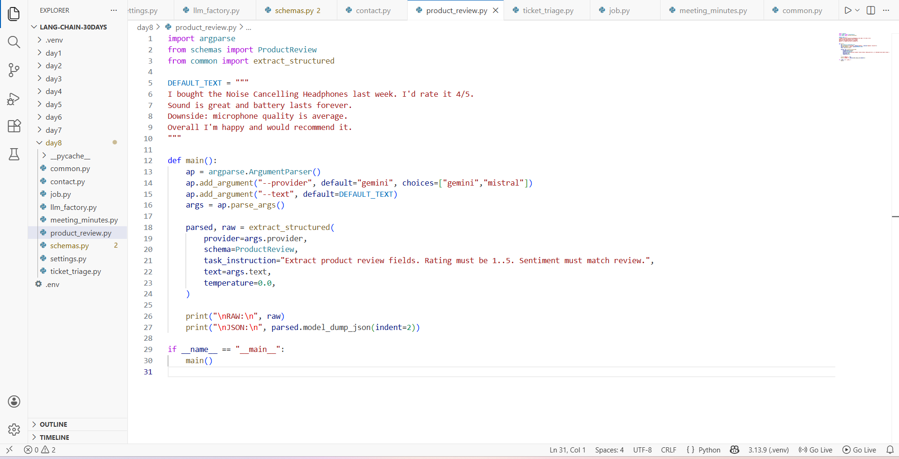
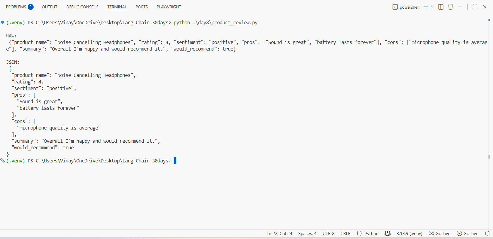

# Day 8 — Structured Output (Pydantic-first): Product Review JSON (LangChain)

This mini-project converts a messy, human-written product review into **validated JSON** using **LangChain + Pydantic**.

You will run a script (`product_review.py`) that:

1. Takes a block of review text
2. Asks the LLM to output **JSON that matches a Pydantic schema**
3. Validates the output (rating range, booleans, lists, etc.)
4. Prints both the raw model output and the final clean JSON

---

## What you’ll get

- A clean JSON object like:
  - product name
  - rating (1–5)
  - sentiment (positive/neutral/negative)
  - pros / cons
  - summary
  - would_recommend (true/false)

---

## Screenshots

### 1) Script code



### 2) Terminal output (RAW + JSON)



---

## Prerequisites

- **Python 3.10+** (3.11/3.12 also OK)
- A virtual environment (recommended)
- One API key:
  - **Gemini** (Google) OR
  - **Mistral**

---

## Project structure

Keep these files inside your repo like this:

```
Lang-Chain-30days/
  .env
  day8/
    product_review.py
    schemas.py
    common.py
    llm_factory.py
    settings.py
```

Important: run commands from the **project root** (`Lang-Chain-30days/`) so imports like `from schemas import ...` work.

---

## 1) Create & activate venv

### Windows (PowerShell)

```powershell
python -m venv .venv
.\.venv\Scripts\Activate.ps1
```

### macOS/Linux

```bash
python3 -m venv .venv
source .venv/bin/activate
```

---

## 2) Install dependencies

```bash
pip install -U langchain langchain-core langchain-google-genai langchain-mistralai
pip install -U pydantic pydantic-settings python-dotenv

# Optional (needed only if you use EmailStr in other schemas)
pip install "pydantic[email]"
```

---

## 3) Add API keys in `.env`

Create a `.env` file in the **project root** (same level as `day8/`).

```env
# Use at least one
GOOGLE_API_KEY=your_gemini_key_here
MISTRAL_API_KEY=your_mistral_key_here

# Optional model defaults
GEMINI_MODEL=gemini-2.5-flash
MISTRAL_MODEL=mistral-large-latest
```

Notes:
- For Gemini: LangChain expects `GOOGLE_API_KEY` (or sometimes `GEMINI_API_KEY`). This project reads the key into `settings.google_api_key`.
- For Mistral: use `MISTRAL_API_KEY`.

---

## 4) Run the product review extractor

### Gemini

```powershell
python .\day8\product_review.py --provider gemini
```

### Mistral

```powershell
python .\day8\product_review.py --provider mistral
```

### With your own text

```powershell
python .\day8\product_review.py --provider gemini --text "I bought ABC earbuds. 5/5. Great sound. Bad mic. Would recommend."
```

---

## Expected output

You will see two sections:

- **RAW**: what the model returned (sometimes includes extra formatting)
- **JSON**: the validated Pydantic output

Example (simplified):

```json
{
  "product_name": "Noise Cancelling Headphones",
  "rating": 4,
  "sentiment": "positive",
  "pros": ["Sound is great", "battery lasts forever"],
  "cons": ["microphone quality is average"],
  "summary": "Overall I'm happy and would recommend it.",
  "would_recommend": true
}
```

---

## How the code works (short & beginner-friendly)

### `schemas.py`
Defines a **Pydantic model** (`ProductReview`) that describes the final JSON structure.

Why this matters:
- If the model returns invalid JSON (wrong types, missing fields, rating out of range), Pydantic will raise an error.
- This forces the output to be clean and consistent.

### `llm_factory.py`
Creates the LLM client for either **Gemini** or **Mistral**.

It also applies policies like:
- `temperature` (creativity control)
- `timeout`
- `retries`

### `common.py`
Contains `extract_structured(...)`:

- Builds a prompt: “Extract these fields into this schema.”
- Calls the LLM
- Tries to parse the response into the Pydantic schema
- Retries a few times if parsing/validation fails

### `product_review.py`
The script you run:

- Provides a default review text (or reads `--text`)
- Calls `extract_structured(schema=ProductReview, ...)`
- Prints RAW + JSON

---

## Copy-paste code (reference)

If you want to recreate the exact files, copy these into `day8/`.

### `product_review.py`

```python
import argparse
from schemas import ProductReview
from common import extract_structured

DEFAULT_TEXT = """I bought the Noise Cancelling Headphones last week. I'd rate it 4/5.
Sound is great and battery lasts forever.
Downside: microphone quality is average.
Overall I'm happy and would recommend it.
"""


def main():
    ap = argparse.ArgumentParser(description="Product review JSON (with validation)")
    ap.add_argument("--provider", default="gemini", choices=["gemini", "mistral"])
    ap.add_argument("--text", default=DEFAULT_TEXT)
    args = ap.parse_args()

    parsed, raw = extract_structured(
        provider=args.provider,
        schema=ProductReview,
        task_instruction="Extract product review fields. Rating must be 1..5. Sentiment must match review.",
        text=args.text,
        temperature=0.0,
    )

    print("\nRAW:\n", raw)
    print("\nJSON:\n", parsed.model_dump_json(indent=2))


if __name__ == "__main__":
    main()
```

### `schemas.py` (only the ProductReview part)

```python
from typing import Literal
from pydantic import BaseModel, Field

class ProductReview(BaseModel):
    product_name: str = Field(..., description="Product name")
    rating: int = Field(..., ge=1, le=5, description="Rating 1-5")
    sentiment: Literal["positive", "neutral", "negative"]
    pros: list[str] = Field(default_factory=list)
    cons: list[str] = Field(default_factory=list)
    summary: str
    would_recommend: bool
```

If your repo already has `common.py`, `llm_factory.py`, `settings.py`, you don’t need to rewrite them.

---

## Troubleshooting

### 1) `API key required ... GOOGLE_API_KEY/GEMINI_API_KEY`
- Make sure `.env` exists in the **project root**
- Ensure it contains `GOOGLE_API_KEY=...`
- Restart the terminal after editing `.env`

### 2) `ModuleNotFoundError: No module named 'schemas'`
- Run from the project root:

```powershell
cd C:\Users\Vinay\OneDrive\Desktop\Lang-Chain-30days
python .\day8\product_review.py
```

### 3) Validation errors (rating not 1–5, wrong sentiment)
- Your schema is doing its job.
- Try setting `temperature=0.0` and keep the task instruction strict.

### 4) Rate limit / timeout
- Try switching provider (`--provider mistral`)
- Increase timeout in `settings.py`

---

## Next ideas (optional upgrades)

- Save JSON to a file: `--out review.json`
- Add stricter enums for product categories
- Run batch extraction on a folder of `.txt` reviews

