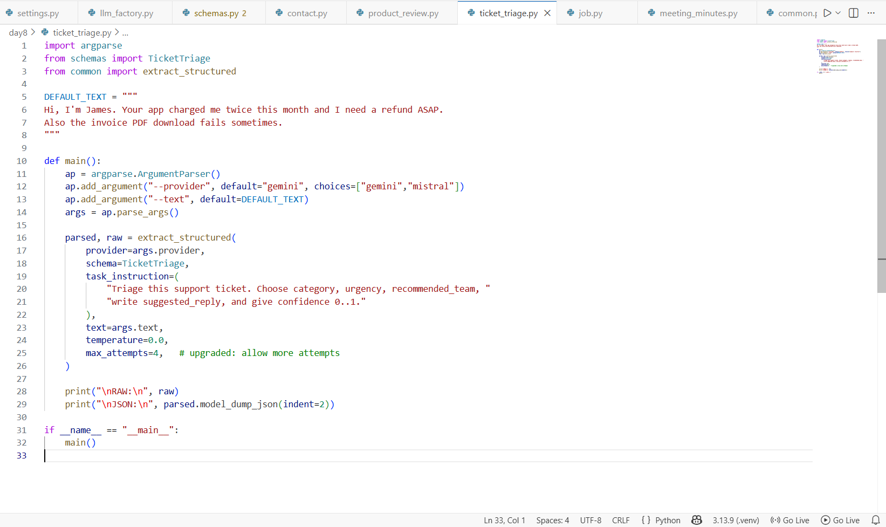
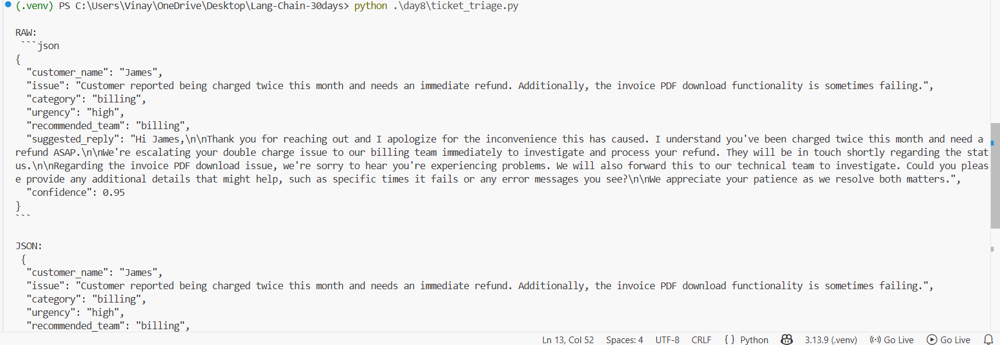

# Day 8 — Structured Output (Pydantic-first)
## Ticket triage (Support ticket → strict JSON)

This script turns a messy support message into **validated JSON**.

It uses:
- **Pydantic**: define the output schema once.
- **LangChain structured output** (`with_structured_output`): the model must fill that schema.
- **Retries**: if the model returns invalid output, we try again a few times.

---

## Folder structure

Put these files inside your project like this:

```
Lang-Chain-30days/
  day8/
    ticket_triage.py
    common.py
    schemas.py
    llm_factory.py
    settings.py
  .env
```

> `.env` stays in the **project root** (`Lang-Chain-30days/.env`) — not inside `day8/`.

---

## Prerequisites

- Python **3.10+**
- A working virtual environment (recommended)
- At least one LLM API key:
  - **Gemini** (Google AI Studio key)
  - **Mistral** (Mistral API key)

---

## Installation (Windows / PowerShell)

From your project root (`Lang-Chain-30days`):

```powershell
# 1) create venv (only once)
python -m venv .venv

# 2) activate venv
.\.venv\Scripts\Activate.ps1

# 3) install deps
pip install -U langchain langchain-core pydantic pydantic-settings langchain-google-genai langchain-mistralai
```

### Create `.env`

Create a file named `.env` in the project root and add your keys:

```env
# put your real keys here
google_api_key=YOUR_GEMINI_API_KEY
mistral_api_key=YOUR_MISTRAL_API_KEY
```

> This project uses `pydantic-settings`, and our `settings.py` reads `.env` automatically.

---

## Run the ticket triage script

### 1) Run with the built-in example (Gemini)

```powershell
python .\day8\ticket_triage.py --provider gemini
```

### 2) Run with Mistral

```powershell
python .\day8\ticket_triage.py --provider mistral
```

### 3) Run with your own ticket text

```powershell
python .\day8\ticket_triage.py --provider gemini --text "Hi, I'm Anya. I was charged twice and need a refund. Also the invoice PDF download is failing."
```

---

## What output you should see

The script prints two sections:

1. **RAW** — the model's raw structured output
2. **JSON** — the same result, pretty-printed after Pydantic validation

The JSON fields include:
- `customer_name`
- `issue`
- `category` (example: `billing`)
- `urgency` (example: `high`)
- `recommended_team`
- `suggested_reply`
- `confidence` (0.0 to 1.0)

---

## How the code works (simple explanation)

### 1) `schemas.py` (Pydantic schema)
You define a Pydantic model (`TicketTriage`) that describes **exactly** what JSON you want.

### 2) `llm_factory.py` (provider switch)
Creates either:
- `ChatGoogleGenerativeAI` (Gemini)
- `ChatMistralAI` (Mistral)

### 3) `common.py` (structured extraction)
- Builds the LLM
- Forces schema output using:
  - `llm.with_structured_output(schema)`
- Invokes the model with your instruction + text
- Retries (up to `max_attempts`) if parsing/validation fails

### 4) `ticket_triage.py` (CLI)
- Reads command line args (`--provider`, `--text`)
- Calls `extract_structured(...)`
- Prints results

---

## Screenshots

### Code (ticket triage script)


### Terminal output


---

## Copy‑paste code (same as your working version)

> If you already have these files, you can skip this section. It’s here so you can copy the code quickly.

### `day8/settings.py`

```python
from pydantic_settings import BaseSettings, SettingsConfigDict


class Settings(BaseSettings):
    # reads from .env automatically
    model_config = SettingsConfigDict(env_file=".env", extra="ignore")

    # API keys (names match .env)
    google_api_key: str | None = None
    mistral_api_key: str | None = None

    # model defaults
    default_provider: str = "gemini"
    gemini_model: str = "gemini-2.5-flash"
    mistral_model: str = "mistral-large-latest"


settings = Settings()
```

### `day8/llm_factory.py`

```python
from settings import settings

from langchain_google_genai import ChatGoogleGenerativeAI
from langchain_mistralai import ChatMistralAI


def build_llm(provider: str | None = None, temperature: float = 0.0):
    provider = (provider or settings.default_provider).lower()

    if provider == "gemini":
        return ChatGoogleGenerativeAI(
            model=settings.gemini_model,
            temperature=temperature,
            api_key=settings.google_api_key,
        )

    if provider == "mistral":
        return ChatMistralAI(
            model=settings.mistral_model,
            temperature=temperature,
            api_key=settings.mistral_api_key,
        )

    raise ValueError(f"Unknown provider: {provider}")
```

### `day8/schemas.py` (TicketTriage)

```python
from typing import Literal
from pydantic import BaseModel, Field


class TicketTriage(BaseModel):
    customer_name: str | None = Field(None, description="Customer name if available")
    issue: str = Field(..., description="Short summary of the issue")
    category: Literal["billing", "bug", "feature", "account", "other"]
    urgency: Literal["low", "medium", "high", "critical"]
    recommended_team: str = Field(..., description="Team that should handle this")
    suggested_reply: str = Field(..., description="Draft a helpful reply to the customer")
    confidence: float = Field(..., ge=0.0, le=1.0, description="Model confidence 0..1")
```

### `day8/common.py`

```python
from langchain_core.messages import SystemMessage, HumanMessage
from pydantic import BaseModel

from llm_factory import build_llm


def extract_structured(
    *,
    provider: str,
    schema: type[BaseModel],
    task_instruction: str,
    text: str,
    temperature: float = 0.0,
    max_attempts: int = 2,
):
    """Return: (parsed_model, raw_text)

    - Forces the model to return output matching `schema`.
    - Retries a few times if the output is invalid.
    """

    last_error = None
    for attempt in range(1, max_attempts + 1):
        try:
            llm = build_llm(provider=provider, temperature=temperature)
            structured = llm.with_structured_output(schema)

            messages = [
                SystemMessage(
                    content=(
                        "You are a strict extractor. "
                        "Return only data that fits the schema."\
                    )
                ),
                HumanMessage(
                    content=(
                        f"Task: {task_instruction}\n\n"
                        f"TEXT:\n{text}"\
                    )
                ),
            ]

            parsed = structured.invoke(messages)
            # If we reach here, Pydantic parsing worked.
            raw = parsed.model_dump_json()
            return parsed, raw

        except Exception as e:
            last_error = e
            # Optional: increase temperature slightly on retries
            temperature = min(0.2, temperature + 0.1)

    raise RuntimeError(f"Structured extraction failed after {max_attempts} attempts: {last_error}")
```

### `day8/ticket_triage.py`

```python
import argparse

from schemas import TicketTriage
from common import extract_structured


DEFAULT_TEXT = """
Hi, I'm James. Your app charged me twice this month and I need a refund ASAP.
Also the invoice PDF download fails sometimes.
"""


def main():
    ap = argparse.ArgumentParser()
    ap.add_argument("--provider", default="gemini", choices=["gemini", "mistral"])
    ap.add_argument("--text", default=DEFAULT_TEXT)
    args = ap.parse_args()

    parsed, raw = extract_structured(
        provider=args.provider,
        schema=TicketTriage,
        task_instruction=(
            "Triage this support ticket. Choose category, urgency, recommended_team, "
            "write suggested_reply, and give confidence 0..1."
        ),
        text=args.text,
        temperature=0.0,
        max_attempts=4,  # upgraded: allow more attempts
    )

    print("\nRAW:\n", raw)
    print("\nJSON:\n", parsed.model_dump_json(indent=2))


if __name__ == "__main__":
    main()
```

---

## Troubleshooting

### Error: “API key required…”
- Confirm your `.env` exists in the **project root**
- Confirm the key names match exactly:
  - `google_api_key=...`
  - `mistral_api_key=...`
- Restart the terminal after editing `.env`

### Error: “ModuleNotFoundError …”
Reinstall dependencies:

```powershell
pip install -U langchain langchain-core pydantic pydantic-settings langchain-google-genai langchain-mistralai
```

### Error: “No such file or directory …ticket_triage.py”
You are likely running from the wrong folder. Run from the project root:

```powershell
cd C:\Users\<YOU>\OneDrive\Desktop\Lang-Chain-30days
python .\day8\ticket_triage.py --provider gemini
```
